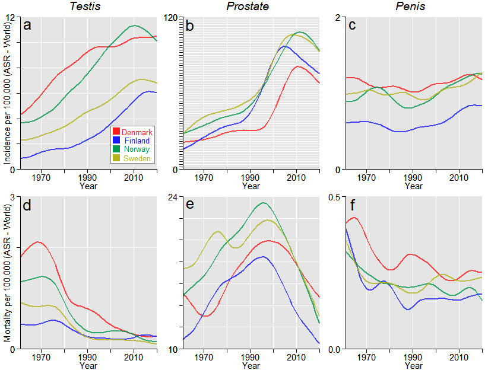

\large
\tableofcontents 

\Large
Please, **cite as** [original article](*TO BE ADDED*) published in [*TO BE ADDED*]

Full citation:
\large
[*TO BE ADDED*]

# Introduction
\large
This report shows source data, their wrangling, fitting statistical models, outputs of the models, and visualizations of both data and probabilistic models. 

All analyses were done using [R sofware](https://www.r-project.org/) in [RStudio](https://www.rstudio.com/) interface.

\newpage
## Software and Packages
\normalsize
Software versions.
\small

```r
rm(list=ls()) # removing all data and objects from R environment
R.version
```

```
##                _                           
## platform       x86_64-w64-mingw32          
## arch           x86_64                      
## os             mingw32                     
## system         x86_64, mingw32             
## status                                     
## major          4                           
## minor          1.2                         
## year           2021                        
## month          11                          
## day            01                          
## svn rev        81115                       
## language       R                           
## version.string R version 4.1.2 (2021-11-01)
## nickname       Bird Hippie
```

```r
rstudioapi::versionInfo()$version
```

```
## [1] '2022.7.2.576'
```
\normalsize
Uploading R packages and their version
\small

```r
library(stringr);packageVersion('stringr')
```

```
## Warning: package 'stringr' was built under R version 4.1.3
```

```
## [1] '1.4.0'
```

```r
library(brms);packageVersion('brms')
```

```
## Warning: package 'brms' was built under R version 4.1.3
```

```
## Loading required package: Rcpp
```

```
## Loading 'brms' package (version 2.18.0). Useful instructions
## can be found by typing help('brms'). A more detailed introduction
## to the package is available through vignette('brms_overview').
```

```
## 
## Attaching package: 'brms'
```

```
## The following object is masked from 'package:stats':
## 
##     ar
```

```
## [1] '2.18.0'
```

```r
packageVersion('Rstan') # uploaded automatically with 'brms'
```

```
## [1] '2.26.6'
```

```r
library(dplyr);packageVersion('dplyr')
```

```
## 
## Attaching package: 'dplyr'
```

```
## The following objects are masked from 'package:stats':
## 
##     filter, lag
```

```
## The following objects are masked from 'package:base':
## 
##     intersect, setdiff, setequal, union
```

```
## [1] '1.0.7'
```


\normalsize
# Incidence and mortality
\small

```r
# setting parameters for smoothing
spar=0.3
knot=12

# colors ---------------------------------------------------------

cola<-c(
  rgb(1,0.1,0.1,alpha=1),
  rgb(0.1,0.1,1,alpha=1),
  rgb(0, 0.6, 0.3,alpha=1),
  rgb(0.7,0.7,0.1,alpha=1))

colb<-c(
  rgb(1,0.1,0.1,alpha=0.2),
  rgb(0.1,0.1,1,alpha=0.2),
  rgb(0, 0.6, 0.3,alpha=0.2),
  rgb(0.7,0.7,0.1,alpha=0.2))

colc<-c(
  rgb(1,0.1,0.1,alpha=0.8),
  rgb(0.1,0.1,1,alpha=0.8),
  rgb(0, 0.6, 0.3,alpha=0.8),
  rgb(0.7,0.7,0.1,alpha=0.8))
```

## Data upload 
\normalsize
Data were downloaded from [Nordcan](https://nordcan.iarc.fr/en/)

\small

```r
## testes data ----------------------------------------------------------
urlfile="https://raw.githubusercontent.com/filip-tichanek/nord_male/main/source-data/testes_inc_mor.csv"
testes_inc_mor<-read.csv(url(urlfile),sep=",")

colnam<-testes_inc_mor[,1]
testes_inc_mor<-data.frame(t(testes_inc_mor))[-1,]
colnames(testes_inc_mor) <- colnam
testes_inc_mor$year <- 1943:2020
### Subset-ting years 1961-2020
testes_inc_mor<-testes_inc_mor[testes_inc_mor$year>1960,]
### Removing space character and converting characters to numbers
x=1;repeat{
testes_inc_mor[,x]<-str_trim(testes_inc_mor[,x])
testes_inc_mor[,x]<-as.numeric(testes_inc_mor[,x])
x=x+1;if(x>9){break}}
summary(testes_inc_mor)
```

```
##  Denmark, incidence Finland, incidence Norway, incidence Sweden, incidence
##  Min.   : 4.300     Min.   :0.610      Min.   : 3.300    Min.   :2.100    
##  1st Qu.: 6.775     1st Qu.:1.600      1st Qu.: 5.025    1st Qu.:3.075    
##  Median : 9.200     Median :2.350      Median : 7.650    Median :4.500    
##  Mean   : 8.452     Mean   :3.022      Mean   : 7.638    Mean   :4.647    
##  3rd Qu.: 9.825     3rd Qu.:4.425      3rd Qu.:10.125    3rd Qu.:6.525    
##  Max.   :11.700     Max.   :6.900      Max.   :12.300    Max.   :7.600    
##  Denmark, mortality Finland, mortality Norway, mortality Sweden, mortality
##  Min.   :0.050      Min.   :0.0500     Min.   :0.0600    Min.   :0.0800   
##  1st Qu.:0.340      1st Qu.:0.1875     1st Qu.:0.2775    1st Qu.:0.1450   
##  Median :0.725      Median :0.2750     Median :0.4300    Median :0.2650   
##  Mean   :0.965      Mean   :0.3350     Mean   :0.6647    Mean   :0.4175   
##  3rd Qu.:1.625      3rd Qu.:0.4550     3rd Qu.:1.0500    3rd Qu.:0.7925   
##  Max.   :2.500      Max.   :0.9900     Max.   :1.7000    Max.   :1.0000   
##       year     
##  Min.   :1961  
##  1st Qu.:1976  
##  Median :1990  
##  Mean   :1990  
##  3rd Qu.:2005  
##  Max.   :2020
```

```r
## prostate data ----------------------------------------------------------
urlfile="https://raw.githubusercontent.com/filip-tichanek/nord_male/main/source-data/prostate_inc_mor.csv"
prostate_inc_mor<-read.csv(url(urlfile),sep=",")
colnam<-prostate_inc_mor[,1]
prostate_inc_mor<-data.frame(t(prostate_inc_mor))[-1,]
colnames(prostate_inc_mor) <- colnam
prostate_inc_mor$year <- 1943:2020
### Subset-ting years 1961-2020
prostate_inc_mor<-prostate_inc_mor[prostate_inc_mor$year>1960,]
### Removing space character and converting characters to numbers
x=1;repeat{
  prostate_inc_mor[,x]<-str_trim(prostate_inc_mor[,x])
  prostate_inc_mor[,x]<-as.numeric(prostate_inc_mor[,x])
  x=x+1;if(x>9){break}}
summary(prostate_inc_mor)
```

```
##  Denmark, incidence Finland, incidence Norway, incidence Sweden, incidence
##  Min.   :20.60      Min.   : 16.70     Min.   : 27.90    Min.   : 26.40   
##  1st Qu.:27.07      1st Qu.: 30.85     1st Qu.: 39.77    1st Qu.: 45.17   
##  Median :31.75      Median : 41.90     Median : 49.55    Median : 56.80   
##  Mean   :42.87      Mean   : 55.34     Mean   : 63.45    Mean   : 66.90   
##  3rd Qu.:66.78      3rd Qu.: 82.38     3rd Qu.: 93.60    3rd Qu.: 97.47   
##  Max.   :90.40      Max.   :116.30     Max.   :115.00    Max.   :116.10   
##  Denmark, mortality Finland, mortality Norway, mortality Sweden, mortality
##  Min.   :11.70      Min.   :10.30      Min.   :12.60     Min.   :13.00    
##  1st Qu.:14.88      1st Qu.:12.53      1st Qu.:16.07     1st Qu.:17.52    
##  Median :16.85      Median :15.20      Median :19.50     Median :19.25    
##  Mean   :16.72      Mean   :14.88      Mean   :18.90     Mean   :19.11    
##  3rd Qu.:18.90      3rd Qu.:17.23      3rd Qu.:21.43     3rd Qu.:21.23    
##  Max.   :20.80      Max.   :19.80      Max.   :24.90     Max.   :22.40    
##       year     
##  Min.   :1961  
##  1st Qu.:1976  
##  Median :1990  
##  Mean   :1990  
##  3rd Qu.:2005  
##  Max.   :2020
```

```r
## penis data ----------------------------------------------------------
urlfile="https://raw.githubusercontent.com/filip-tichanek/nord_male/main/source-data/penis_inc_mor.csv"
penis_inc_mor<-read.csv(url(urlfile),sep=",")
colnam<-penis_inc_mor[,1]
penis_inc_mor<-data.frame(t(penis_inc_mor))[-1,]
colnames(penis_inc_mor) <- colnam
penis_inc_mor$year <- 1943:2020
### Subseting years 1961-2020
penis_inc_mor<-penis_inc_mor[penis_inc_mor$year>1960,]
### Removing space character and converting characters to numbers
x=1;repeat{
  penis_inc_mor[,x]<-str_trim(penis_inc_mor[,x])
  penis_inc_mor[,x]<-as.numeric(penis_inc_mor[,x])
  x=x+1;if(x>9){break}}
summary(penis_inc_mor)
```

```
##  Denmark, incidence Finland, incidence Norway, incidence Sweden, incidence
##  Min.   :0.800      Min.   :0.1900     Min.   :0.5400    Min.   :0.7400   
##  1st Qu.:1.000      1st Qu.:0.5000     1st Qu.:0.8075    1st Qu.:0.9425   
##  Median :1.100      Median :0.6150     Median :0.9600    Median :1.0000   
##  Mean   :1.128      Mean   :0.6267     Mean   :1.0048    Mean   :1.0300   
##  3rd Qu.:1.300      3rd Qu.:0.7625     3rd Qu.:1.2000    3rd Qu.:1.1000   
##  Max.   :1.500      Max.   :1.1000     Max.   :1.8000    Max.   :1.5000   
##  Denmark, mortality Finland, mortality Norway, mortality Sweden, mortality
##  Min.   :0.0800     Min.   :0.0000     Min.   :0.0300    Min.   :0.0900   
##  1st Qu.:0.2275     1st Qu.:0.1150     1st Qu.:0.1500    1st Qu.:0.1800   
##  Median :0.2700     Median :0.1700     Median :0.2150    Median :0.2200   
##  Mean   :0.2930     Mean   :0.1902     Mean   :0.2153    Mean   :0.2268   
##  3rd Qu.:0.3450     3rd Qu.:0.2200     3rd Qu.:0.2725    3rd Qu.:0.2625   
##  Max.   :0.7300     Max.   :0.9800     Max.   :0.4300    Max.   :0.4300   
##       year     
##  Min.   :1961  
##  1st Qu.:1976  
##  Median :1990  
##  Mean   :1990  
##  3rd Qu.:2005  
##  Max.   :2020
```


## Suppl. Figure - Incidence and Moratlity
\small

```r
# Plotting - incidence -------------------------
## General setting and titles of plots
m <- matrix(c(1 ,2 ,3,
              4 ,5 ,6,
              7, 8, 9), nrow = 3, ncol =3 ,byrow = TRUE)
layout(mat = m,heights = c(0.03,0.485,0.485))
par(mgp=c(1.6,0.8,0))
par(mar=c(0,0,0,0))

plot(NULL, axes=FALSE,xlab="",ylab="",xlim=c(-1,1),ylim=c(-0.85,0.85))
text(0.05,-0.,"Testis",cex=1.8,font=3,xpd=TRUE)

plot(NULL, axes=FALSE,xlab="",ylab="",xlim=c(-1,1),ylim=c(-0.85,0.85))
text(0.05,-0.,"Prostate",cex=1.8,font=3,xpd=TRUE)

plot(NULL, axes=FALSE,xlab="",ylab="",xlim=c(-1,1),ylim=c(-0.85,0.85))
text(0.05,-0.,"Penis",cex=1.8,font=3,xpd=TRUE)


## Plot of testes cancer ----------------
summary(testes_inc_mor)
```

```
##  Denmark, incidence Finland, incidence Norway, incidence Sweden, incidence
##  Min.   : 4.300     Min.   :0.610      Min.   : 3.300    Min.   :2.100    
##  1st Qu.: 6.775     1st Qu.:1.600      1st Qu.: 5.025    1st Qu.:3.075    
##  Median : 9.200     Median :2.350      Median : 7.650    Median :4.500    
##  Mean   : 8.452     Mean   :3.022      Mean   : 7.638    Mean   :4.647    
##  3rd Qu.: 9.825     3rd Qu.:4.425      3rd Qu.:10.125    3rd Qu.:6.525    
##  Max.   :11.700     Max.   :6.900      Max.   :12.300    Max.   :7.600    
##  Denmark, mortality Finland, mortality Norway, mortality Sweden, mortality
##  Min.   :0.050      Min.   :0.0500     Min.   :0.0600    Min.   :0.0800   
##  1st Qu.:0.340      1st Qu.:0.1875     1st Qu.:0.2775    1st Qu.:0.1450   
##  Median :0.725      Median :0.2750     Median :0.4300    Median :0.2650   
##  Mean   :0.965      Mean   :0.3350     Mean   :0.6647    Mean   :0.4175   
##  3rd Qu.:1.625      3rd Qu.:0.4550     3rd Qu.:1.0500    3rd Qu.:0.7925   
##  Max.   :2.500      Max.   :0.9900     Max.   :1.7000    Max.   :1.0000   
##       year     
##  Min.   :1961  
##  1st Qu.:1976  
##  Median :1990  
##  Mean   :1990  
##  3rd Qu.:2005  
##  Max.   :2020
```

```r
par(mgp=c(0.1,0.7,0))
par(mar=c(2,2,0,0))

range<-c(0,12);scal<-range[2]-range[1]
xrange<-c(1961,2020)

plot(NULL,xlim=xrange,ylim=c(range[1],range[2]),xlab="",ylab=""
     ,las=1, axes=FALSE)
rect(xrange[1],range[2],xrange[2],range[1],col="grey90",border=NA)
x<-range[1]
repeat{
  lines(c(xrange[1],xrange[2]),c(x,x),col="white")
  x=x+2;if(x>range[2]){break}}

x<- round(xrange[1]+5,-1)
repeat{
  lines(c(x,x),c(range[1],range[2]),col="white")
  x=x+10;if(x>2020){break}}


data=testes_inc_mor;xx<-1
repeat{
smoothingSpline = smooth.spline(data$year, data[,xx], spar=spar, nknots=knot)
lines(smoothingSpline,col=colc[xx],lty=1,lwd=2,lend=1)
xx=xx+1;if(xx>4){break}}

axis(2,las=2,cex.axis=1.4,at=seq(range[1],range[2],by=2),labels=c(range[1],
        rep("",length(seq(range[1],range[2],by=2))-2),range[2]),pos=xrange[1],tck= -0.025)
axis(2,las=2,cex.axis=1.4,at=c(range[1],range[2]),pos=xrange[1],tck= -0.025)
title(ylab="Incidence per 100,000 (ASR - World)", line=0.5, cex.lab=1.4)
axis(side=1,las=1,cex.axis=1.4,at=c(seq(round(xrange[1]+5,-1),2020,by=10)),pos=range[1],
     tck= -0.025)
lines(c(xrange[1],xrange[2]),c(range[1],range[1]))
title(xlab="Year", line=1, cex.lab=1.4,xpd=TRUE)
text(1964,range[2]-0.05*scal,"a",cex=2.5)

xx=1;yy=range[1]+scal*0.25
rect(2000,yy+0.035*scal,2019,yy-0.21*scal,col="white",border="grey50",lwd=0.8)
repeat{
  lines(c(2001,2004),c(yy,yy),lwd=12,col=cola[xx],lend=1)
  xx<-xx+1;yy=yy-(scal*0.058);if(xx>4){break}}


xx=1;yy=range[1]+scal*0.25
text(2011.5,yy,"Denmark",col=cola[xx],cex=1.25);xx=xx+1;yy=yy-(scal*0.058)
text(2011.5,yy,"Finland",col=cola[xx],cex=1.25);xx=xx+1;yy=yy-(scal*0.058)
text(2011.5,yy,"Norway",col=cola[xx],cex=1.25);xx=xx+1;yy=yy-(scal*0.058)
text(2011.4,yy,"Sweden",col=cola[xx],cex=1.25);xx=xx+1;yy=yy-(scal*0.058)


## Plot of prostate cancer ----------------
summary(prostate_inc_mor)
```

```
##  Denmark, incidence Finland, incidence Norway, incidence Sweden, incidence
##  Min.   :20.60      Min.   : 16.70     Min.   : 27.90    Min.   : 26.40   
##  1st Qu.:27.07      1st Qu.: 30.85     1st Qu.: 39.77    1st Qu.: 45.17   
##  Median :31.75      Median : 41.90     Median : 49.55    Median : 56.80   
##  Mean   :42.87      Mean   : 55.34     Mean   : 63.45    Mean   : 66.90   
##  3rd Qu.:66.78      3rd Qu.: 82.38     3rd Qu.: 93.60    3rd Qu.: 97.47   
##  Max.   :90.40      Max.   :116.30     Max.   :115.00    Max.   :116.10   
##  Denmark, mortality Finland, mortality Norway, mortality Sweden, mortality
##  Min.   :11.70      Min.   :10.30      Min.   :12.60     Min.   :13.00    
##  1st Qu.:14.88      1st Qu.:12.53      1st Qu.:16.07     1st Qu.:17.52    
##  Median :16.85      Median :15.20      Median :19.50     Median :19.25    
##  Mean   :16.72      Mean   :14.88      Mean   :18.90     Mean   :19.11    
##  3rd Qu.:18.90      3rd Qu.:17.23      3rd Qu.:21.43     3rd Qu.:21.23    
##  Max.   :20.80      Max.   :19.80      Max.   :24.90     Max.   :22.40    
##       year     
##  Min.   :1961  
##  1st Qu.:1976  
##  Median :1990  
##  Mean   :1990  
##  3rd Qu.:2005  
##  Max.   :2020
```

```r
range<-c(0,120);scal<-range[2]-range[1]
xrange<-c(1961,2020)

plot(NULL,xlim=xrange,ylim=c(range[1],range[2]),xlab="",ylab=""
     ,las=1, axes=FALSE)
rect(xrange[1],range[2],xrange[2],range[1],col="grey90",border=NA)
x<-range[1]
repeat{
  lines(c(xrange[1],xrange[2]),c(x,x),col="white")
  x=x+2;if(x>range[2]){break}}

x<- round(xrange[1]+5,-1)
repeat{
  lines(c(x,x),c(range[1],range[2]),col="white")
  x=x+10;if(x>2020){break}}


data=prostate_inc_mor;xx<-1
repeat{
  smoothingSpline = smooth.spline(data$year, data[,xx], spar=spar, nknots=knot)
  lines(smoothingSpline,col=colc[xx],lty=1,lwd=2,lend=1)
  xx=xx+1;if(xx>4){break}}

axis(2,las=2,cex.axis=1.4,at=seq(range[1],range[2],by=2),labels=c(range[1],
   rep("",length(seq(range[1],range[2],by=2))-2),range[2]),pos=xrange[1],tck= -0.025)
axis(2,las=2,cex.axis=1.4,at=c(range[1],range[2]),pos=xrange[1],tck= -0.025)
#title(ylab="Incidence per 100,000 (ASR - World)", line=0.5, cex.lab=1.4)
axis(side=1,las=1,cex.axis=1.4,at=c(seq(round(xrange[1]+5,-1),2020,by=10)),pos=range[1],
     tck= -0.025)
lines(c(xrange[1],xrange[2]),c(range[1],range[1]))
title(xlab="Year", line=1, cex.lab=1.4,xpd=TRUE)
text(1964,range[2]-0.05*scal,"b",cex=2.5)


## Plot of penis cancer ----------------
summary(penis_inc_mor)
```

```
##  Denmark, incidence Finland, incidence Norway, incidence Sweden, incidence
##  Min.   :0.800      Min.   :0.1900     Min.   :0.5400    Min.   :0.7400   
##  1st Qu.:1.000      1st Qu.:0.5000     1st Qu.:0.8075    1st Qu.:0.9425   
##  Median :1.100      Median :0.6150     Median :0.9600    Median :1.0000   
##  Mean   :1.128      Mean   :0.6267     Mean   :1.0048    Mean   :1.0300   
##  3rd Qu.:1.300      3rd Qu.:0.7625     3rd Qu.:1.2000    3rd Qu.:1.1000   
##  Max.   :1.500      Max.   :1.1000     Max.   :1.8000    Max.   :1.5000   
##  Denmark, mortality Finland, mortality Norway, mortality Sweden, mortality
##  Min.   :0.0800     Min.   :0.0000     Min.   :0.0300    Min.   :0.0900   
##  1st Qu.:0.2275     1st Qu.:0.1150     1st Qu.:0.1500    1st Qu.:0.1800   
##  Median :0.2700     Median :0.1700     Median :0.2150    Median :0.2200   
##  Mean   :0.2930     Mean   :0.1902     Mean   :0.2153    Mean   :0.2268   
##  3rd Qu.:0.3450     3rd Qu.:0.2200     3rd Qu.:0.2725    3rd Qu.:0.2625   
##  Max.   :0.7300     Max.   :0.9800     Max.   :0.4300    Max.   :0.4300   
##       year     
##  Min.   :1961  
##  1st Qu.:1976  
##  Median :1990  
##  Mean   :1990  
##  3rd Qu.:2005  
##  Max.   :2020
```

```r
range<-c(0,2);scal<-range[2]-range[1]
xrange<-c(1961,2020)

plot(NULL,xlim=xrange,ylim=c(range[1],range[2]),xlab="",ylab=""
     ,las=1, axes=FALSE)
rect(xrange[1],range[2],xrange[2],range[1],col="grey90",border=NA)
x<-range[1]
repeat{
  lines(c(xrange[1],xrange[2]),c(x,x),col="white")
  x=x+2;if(x>range[2]){break}}

x<- round(xrange[1]+5,-1)
repeat{
  lines(c(x,x),c(range[1],range[2]),col="white")
  x=x+10;if(x>2020){break}}

data=penis_inc_mor;xx<-1
repeat{
  smoothingSpline = smooth.spline(data$year, data[,xx], spar=spar, nknots=knot)
  lines(smoothingSpline,col=colc[xx],lty=1,lwd=2,lend=1)
  xx=xx+1;if(xx>4){break}}

axis(2,las=2,cex.axis=1.4,at=seq(range[1],range[2],by=2),labels=c(range[1],
                                                                  rep("",length(seq(range[1],range[2],by=2))-2),range[2]),pos=xrange[1],tck= -0.025)
axis(2,las=2,cex.axis=1.4,at=c(range[1],range[2]),pos=xrange[1],tck= -0.025)
#title(ylab="Incidence per 100,000 (ASR - World)", line=0.5, cex.lab=1.4)
axis(side=1,las=1,cex.axis=1.4,at=c(seq(round(xrange[1]+5,-1),2020,by=10)),pos=range[1],
     tck= -0.025)
lines(c(xrange[1],xrange[2]),c(range[1],range[1]))
title(xlab="Year", line=1, cex.lab=1.4,xpd=TRUE)
text(1964,range[2]-0.05*scal,"c",cex=2.5)


# Plotting - mortality-------------------
## Plot of testes cancer ----------------
range<-c(0,3);scal<-range[2]-range[1]
xrange<-c(1961,2020)

plot(NULL,xlim=xrange,ylim=c(range[1],range[2]),xlab="",ylab=""
     ,las=1, axes=FALSE)
rect(xrange[1],range[2],xrange[2],range[1],col="grey90",border=NA)
x<-range[1]
repeat{
  lines(c(xrange[1],xrange[2]),c(x,x),col="white")
  x=x+2;if(x>range[2]){break}}

x<- round(xrange[1]+5,-1)
repeat{
  lines(c(x,x),c(range[1],range[2]),col="white")
  x=x+10;if(x>2020){break}}


data=testes_inc_mor;xx<-5
repeat{
  smoothingSpline = smooth.spline(data$year, data[,xx], spar=spar, nknots=knot)
  lines(smoothingSpline,col=colc[xx-4],lty=1,lwd=2,lend=1)
  xx=xx+1;if(xx>8){break}}

axis(2,las=2,cex.axis=1.4,at=seq(range[1],range[2],by=2),
     labels=c(range[1],rep("",length(seq(range[1],range[2],by=2))-2),""),pos=xrange[1],tck= -0.025)
axis(2,las=2,cex.axis=1.4,at=c(range[1],range[2]),pos=xrange[1],tck= -0.025)
title(ylab="Mortality per 100,000 (ASR - World)", line=0.5, cex.lab=1.4)
axis(side=1,las=1,cex.axis=1.4,at=c(seq(round(xrange[1]+5,-1),2020,by=10)),pos=range[1],
     tck= -0.025)
lines(c(xrange[1],xrange[2]),c(range[1],range[1]))
title(xlab="Year", line=1, cex.lab=1.4,xpd=TRUE)
text(1964,range[2]-0.05*scal,"d",cex=2.5)

## Plot of prostate cancer ----------------
range<-c(10,24);scal<-range[2]-range[1]
xrange<-c(1961,2020)

plot(NULL,xlim=xrange,ylim=c(range[1],range[2]),xlab="",ylab=""
     ,las=1, axes=FALSE)
rect(xrange[1],range[2],xrange[2],range[1],col="grey90",border=NA)
x<-range[1]
repeat{
  lines(c(xrange[1],xrange[2]),c(x,x),col="white")
  x=x+2;if(x>range[2]){break}}

x<- round(xrange[1]+5,-1)
repeat{
  lines(c(x,x),c(range[1],range[2]),col="white")
  x=x+10;if(x>2020){break}}


data=prostate_inc_mor;xx<-5
repeat{
  smoothingSpline = smooth.spline(data$year, data[,xx], spar=spar, nknots=knot)
  lines(smoothingSpline,col=colc[xx-4],lty=1,lwd=2,lend=1)
  xx=xx+1;if(xx>8){break}}

axis(2,las=2,cex.axis=1.4,at=seq(range[1],range[2],by=2),
     labels=c(range[1],rep("",length(seq(range[1],range[2],by=2))-2),""),pos=xrange[1],tck= -0.025)
axis(2,las=2,cex.axis=1.4,at=c(range[1],range[2]),pos=xrange[1],tck= -0.025)
#title(ylab="Incidence per 100,000 (ASR - World)", line=0.5, cex.lab=1.4)
axis(side=1,las=1,cex.axis=1.4,at=c(seq(round(xrange[1]+5,-1),2020,by=10)),pos=range[1],
     tck= -0.025)
lines(c(xrange[1],xrange[2]),c(range[1],range[1]))
title(xlab="Year", line=1, cex.lab=1.4,xpd=TRUE)
text(1964,range[2]-0.05*scal,"e",cex=2.5)


## Plot of penis cancer ----------------
range<-c(0,0.5);scal<-range[2]-range[1]
xrange<-c(1961,2020)

plot(NULL,xlim=xrange,ylim=c(range[1],range[2]),xlab="",ylab=""
     ,las=1, axes=FALSE)
rect(xrange[1],range[2],xrange[2],range[1],col="grey90",border=NA)
x<-range[1]
repeat{
  lines(c(xrange[1],xrange[2]),c(x,x),col="white")
  x=x+2;if(x>range[2]){break}}

x<- round(xrange[1]+5,-1)
repeat{
  lines(c(x,x),c(range[1],range[2]),col="white")
  x=x+10;if(x>2020){break}}


data=penis_inc_mor;xx<-5
repeat{
  smoothingSpline = smooth.spline(data$year, data[,xx], spar=spar, nknots=knot)
  lines(smoothingSpline,col=colc[xx-4],lty=1,lwd=2,lend=1)
  xx=xx+1;if(xx>8){break}}
axis(2,las=2,cex.axis=1.4,at=c(range[1],range[2]),pos=xrange[1],tck= -0.025)
#title(ylab="Incidence per 100,000 (ASR - World)", line=0.5, cex.lab=1.4)
axis(side=1,las=1,cex.axis=1.4,at=c(seq(round(xrange[1]+5,-1),2020,by=10)),pos=range[1],
     tck= -0.025)
lines(c(xrange[1],xrange[2]),c(range[1],range[1]))
title(xlab="Year", line=1, cex.lab=1.4,xpd=TRUE)
text(1964,range[2]-0.05*scal,"f",cex=2.5)
```



