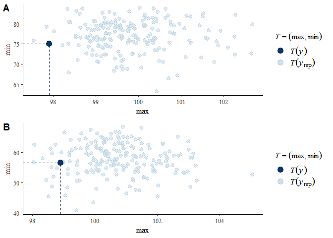
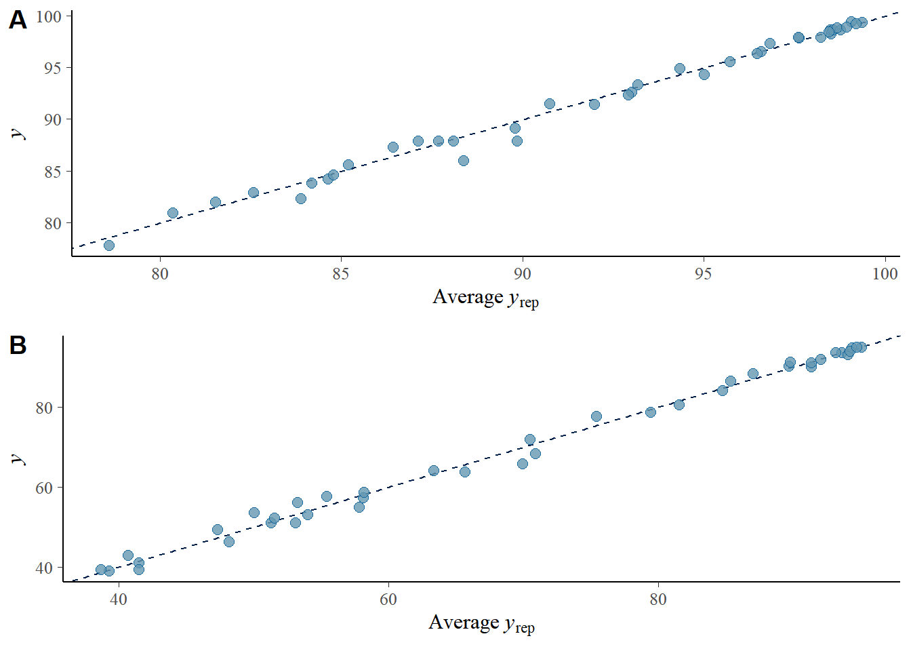
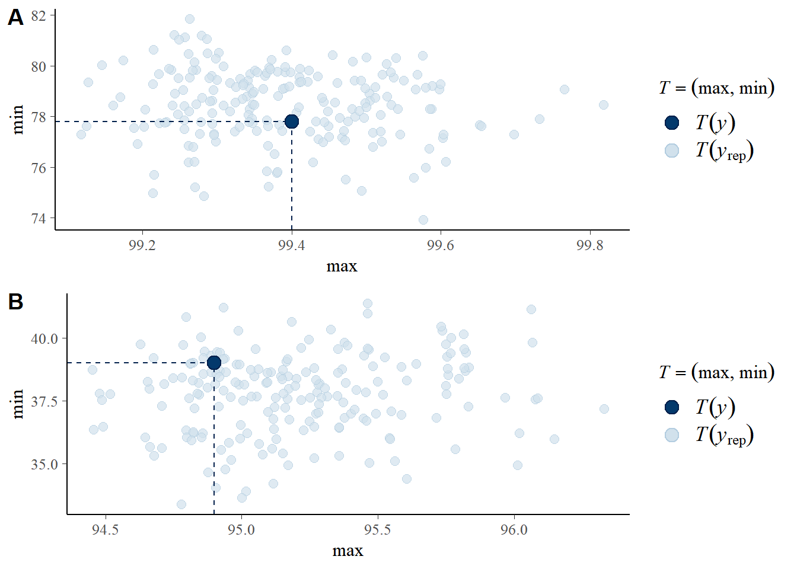

# Periodic and conditional survival trends in prostate, testicular and penile cancers in the nordic countries marking timing of improvements"

Full R code

authors: Filip Tichanek, Asta Försti, Akseli Hemminki, Otto Hemminki, Kari Hemminki

date: January 08, 2023


Please, **cite as** [original article](*TO BE ADDED*) published in [*TO BE ADDED*]

Full citation:

[*TO BE ADDED*]

# Introduction

This report shows source data, their wrangling, fitting statistical models, outputs of the models, and visualizations of both data and probabilistic models. 

All analyses were done using [R sofware](https://www.r-project.org/) in [RStudio](https://www.rstudio.com/) interface.

## Software and Packages

Software versions.

Uploading R packages and their version


```r
rm(list=ls()) # removing all data and objects from R environment
library(stringr)
library(brms)
library(dplyr)
library(sessioninfo)
library(cowplot)
```


# Incidence and mortality


```r
# setting parameters for smoothing
spar=0.3
knot=12

# colors ---------------------------------------------------------

cola<-c(
  rgb(1,0.1,0.1,alpha=1),
  rgb(0.1,0.1,1,alpha=1),
  rgb(0, 0.6, 0.3,alpha=1),
  rgb(0.7,0.7,0.1,alpha=1))

colb<-c(
  rgb(1,0.1,0.1,alpha=0.2),
  rgb(0.1,0.1,1,alpha=0.2),
  rgb(0, 0.6, 0.3,alpha=0.2),
  rgb(0.7,0.7,0.1,alpha=0.2))

colc<-c(
  rgb(1,0.1,0.1,alpha=0.8),
  rgb(0.1,0.1,1,alpha=0.8),
  rgb(0, 0.6, 0.3,alpha=0.8),
  rgb(0.7,0.7,0.1,alpha=0.8))
```

## Data upload 

Data were downloaded from [Nordcan](https://nordcan.iarc.fr/en/)


```r
## testes data ----------------------------------------------------------
urlfile="https://raw.githubusercontent.com/filip-tichanek/nord_male/main/source-data/testes_inc_mor.csv"
testes_inc_mor<-read.csv(url(urlfile),sep=",")

colnam<-testes_inc_mor[,1]
testes_inc_mor<-data.frame(t(testes_inc_mor))[-1,]
colnames(testes_inc_mor) <- colnam
testes_inc_mor$year <- 1943:2020
### Subset-ting years 1961-2020
testes_inc_mor<-testes_inc_mor[testes_inc_mor$year>1960,]
### Removing space character and converting characters to numbers
x=1;repeat{
testes_inc_mor[,x]<-str_trim(testes_inc_mor[,x])
testes_inc_mor[,x]<-as.numeric(testes_inc_mor[,x])
x=x+1;if(x>9){break}}
summary(testes_inc_mor)
```

```
##  Denmark, incidence Finland, incidence Norway, incidence Sweden, incidence
##  Min.   : 4.300     Min.   :0.610      Min.   : 3.300    Min.   :2.100    
##  1st Qu.: 6.775     1st Qu.:1.600      1st Qu.: 5.025    1st Qu.:3.075    
##  Median : 9.200     Median :2.350      Median : 7.650    Median :4.500    
##  Mean   : 8.452     Mean   :3.022      Mean   : 7.638    Mean   :4.647    
##  3rd Qu.: 9.825     3rd Qu.:4.425      3rd Qu.:10.125    3rd Qu.:6.525    
##  Max.   :11.700     Max.   :6.900      Max.   :12.300    Max.   :7.600    
##  Denmark, mortality Finland, mortality Norway, mortality Sweden, mortality
##  Min.   :0.050      Min.   :0.0500     Min.   :0.0600    Min.   :0.0800   
##  1st Qu.:0.340      1st Qu.:0.1875     1st Qu.:0.2775    1st Qu.:0.1450   
##  Median :0.725      Median :0.2750     Median :0.4300    Median :0.2650   
##  Mean   :0.965      Mean   :0.3350     Mean   :0.6647    Mean   :0.4175   
##  3rd Qu.:1.625      3rd Qu.:0.4550     3rd Qu.:1.0500    3rd Qu.:0.7925   
##  Max.   :2.500      Max.   :0.9900     Max.   :1.7000    Max.   :1.0000   
##       year     
##  Min.   :1961  
##  1st Qu.:1976  
##  Median :1990  
##  Mean   :1990  
##  3rd Qu.:2005  
##  Max.   :2020
```

```r
## prostate data ----------------------------------------------------------
urlfile="https://raw.githubusercontent.com/filip-tichanek/nord_male/main/source-data/prostate_inc_mor.csv"
prostate_inc_mor<-read.csv(url(urlfile),sep=",")
colnam<-prostate_inc_mor[,1]
prostate_inc_mor<-data.frame(t(prostate_inc_mor))[-1,]
colnames(prostate_inc_mor) <- colnam
prostate_inc_mor$year <- 1943:2020
### Subset-ting years 1961-2020
prostate_inc_mor<-prostate_inc_mor[prostate_inc_mor$year>1960,]
### Removing space character and converting characters to numbers
x=1;repeat{
  prostate_inc_mor[,x]<-str_trim(prostate_inc_mor[,x])
  prostate_inc_mor[,x]<-as.numeric(prostate_inc_mor[,x])
  x=x+1;if(x>9){break}}
summary(prostate_inc_mor)
```

```
##  Denmark, incidence Finland, incidence Norway, incidence Sweden, incidence
##  Min.   :20.60      Min.   : 16.70     Min.   : 27.90    Min.   : 26.40   
##  1st Qu.:27.07      1st Qu.: 30.85     1st Qu.: 39.77    1st Qu.: 45.17   
##  Median :31.75      Median : 41.90     Median : 49.55    Median : 56.80   
##  Mean   :42.87      Mean   : 55.34     Mean   : 63.45    Mean   : 66.90   
##  3rd Qu.:66.78      3rd Qu.: 82.38     3rd Qu.: 93.60    3rd Qu.: 97.47   
##  Max.   :90.40      Max.   :116.30     Max.   :115.00    Max.   :116.10   
##  Denmark, mortality Finland, mortality Norway, mortality Sweden, mortality
##  Min.   :11.70      Min.   :10.30      Min.   :12.60     Min.   :13.00    
##  1st Qu.:14.88      1st Qu.:12.53      1st Qu.:16.07     1st Qu.:17.52    
##  Median :16.85      Median :15.20      Median :19.50     Median :19.25    
##  Mean   :16.72      Mean   :14.88      Mean   :18.90     Mean   :19.11    
##  3rd Qu.:18.90      3rd Qu.:17.23      3rd Qu.:21.43     3rd Qu.:21.23    
##  Max.   :20.80      Max.   :19.80      Max.   :24.90     Max.   :22.40    
##       year     
##  Min.   :1961  
##  1st Qu.:1976  
##  Median :1990  
##  Mean   :1990  
##  3rd Qu.:2005  
##  Max.   :2020
```

```r
## penis data ----------------------------------------------------------
urlfile="https://raw.githubusercontent.com/filip-tichanek/nord_male/main/source-data/penis_inc_mor.csv"
penis_inc_mor<-read.csv(url(urlfile),sep=",")
colnam<-penis_inc_mor[,1]
penis_inc_mor<-data.frame(t(penis_inc_mor))[-1,]
colnames(penis_inc_mor) <- colnam
penis_inc_mor$year <- 1943:2020
### Subseting years 1961-2020
penis_inc_mor<-penis_inc_mor[penis_inc_mor$year>1960,]
### Removing space character and converting characters to numbers
x=1;repeat{
  penis_inc_mor[,x]<-str_trim(penis_inc_mor[,x])
  penis_inc_mor[,x]<-as.numeric(penis_inc_mor[,x])
  x=x+1;if(x>9){break}}
summary(penis_inc_mor)
```

```
##  Denmark, incidence Finland, incidence Norway, incidence Sweden, incidence
##  Min.   :0.800      Min.   :0.1900     Min.   :0.5400    Min.   :0.7400   
##  1st Qu.:1.000      1st Qu.:0.5000     1st Qu.:0.8075    1st Qu.:0.9425   
##  Median :1.100      Median :0.6150     Median :0.9600    Median :1.0000   
##  Mean   :1.128      Mean   :0.6267     Mean   :1.0048    Mean   :1.0300   
##  3rd Qu.:1.300      3rd Qu.:0.7625     3rd Qu.:1.2000    3rd Qu.:1.1000   
##  Max.   :1.500      Max.   :1.1000     Max.   :1.8000    Max.   :1.5000   
##  Denmark, mortality Finland, mortality Norway, mortality Sweden, mortality
##  Min.   :0.0800     Min.   :0.0000     Min.   :0.0300    Min.   :0.0900   
##  1st Qu.:0.2275     1st Qu.:0.1150     1st Qu.:0.1500    1st Qu.:0.1800   
##  Median :0.2700     Median :0.1700     Median :0.2150    Median :0.2200   
##  Mean   :0.2930     Mean   :0.1902     Mean   :0.2153    Mean   :0.2268   
##  3rd Qu.:0.3450     3rd Qu.:0.2200     3rd Qu.:0.2725    3rd Qu.:0.2625   
##  Max.   :0.7300     Max.   :0.9800     Max.   :0.4300    Max.   :0.4300   
##       year     
##  Min.   :1961  
##  1st Qu.:1976  
##  Median :1990  
##  Mean   :1990  
##  3rd Qu.:2005  
##  Max.   :2020
```


## Suppl. Figure - Incidence and Moratlity


```r
# Plotting - incidence -------------------------
## General setting and titles of plots
m <- matrix(c(1 ,2 ,3,
              4 ,5 ,6,
              7, 8, 9), nrow = 3, ncol =3 ,byrow = TRUE)
layout(mat = m,heights = c(0.03,0.485,0.485))
par(mgp=c(1.6,0.8,0))
par(mar=c(0,0,0,0))

plot(NULL, axes=FALSE,xlab="",ylab="",xlim=c(-1,1),ylim=c(-0.85,0.85))
text(0.05,-0.,"Testis",cex=1.8,font=3,xpd=TRUE)

plot(NULL, axes=FALSE,xlab="",ylab="",xlim=c(-1,1),ylim=c(-0.85,0.85))
text(0.05,-0.,"Prostate",cex=1.8,font=3,xpd=TRUE)

plot(NULL, axes=FALSE,xlab="",ylab="",xlim=c(-1,1),ylim=c(-0.85,0.85))
text(0.05,-0.,"Penis",cex=1.8,font=3,xpd=TRUE)


## Plot of testes cancer ----------------
par(mgp=c(0.1,0.7,0))
par(mar=c(2,2,0,0))

range<-c(0,12);scal<-range[2]-range[1]
xrange<-c(1961,2020)

plot(NULL,xlim=xrange,ylim=c(range[1],range[2]),xlab="",ylab=""
     ,las=1, axes=FALSE)
rect(xrange[1],range[2],xrange[2],range[1],col="grey90",border=NA)
x<-range[1]
repeat{
  lines(c(xrange[1],xrange[2]),c(x,x),col="white")
  x=x+2;if(x>range[2]){break}}

x<- round(xrange[1]+5,-1)
repeat{
  lines(c(x,x),c(range[1],range[2]),col="white")
  x=x+10;if(x>2020){break}}


data=testes_inc_mor;xx<-1
repeat{
smoothingSpline = smooth.spline(data$year, data[,xx], spar=spar, nknots=knot)
lines(smoothingSpline,col=colc[xx],lty=1,lwd=2,lend=1)
xx=xx+1;if(xx>4){break}}

axis(2,las=2,cex.axis=1.4,at=seq(range[1],range[2],by=2),labels=c(range[1],
        rep("",length(seq(range[1],range[2],by=2))-2),range[2]),pos=xrange[1],tck= -0.025)
axis(2,las=2,cex.axis=1.4,at=c(range[1],range[2]),pos=xrange[1],tck= -0.025)
title(ylab="Incidence per 100,000 (ASR - World)", line=0.5, cex.lab=1.4)
axis(side=1,las=1,cex.axis=1.4,at=c(seq(round(xrange[1]+5,-1),2020,by=10)),pos=range[1],
     tck= -0.025)
lines(c(xrange[1],xrange[2]),c(range[1],range[1]))
title(xlab="Year", line=1, cex.lab=1.4,xpd=TRUE)
text(1964,range[2]-0.05*scal,"a",cex=2.5)

xx=1;yy=range[1]+scal*0.25
rect(2000,yy+0.035*scal,2019,yy-0.21*scal,col="white",border="grey50",lwd=0.8)
repeat{
  lines(c(2001,2004),c(yy,yy),lwd=12,col=cola[xx],lend=1)
  xx<-xx+1;yy=yy-(scal*0.058);if(xx>4){break}}


xx=1;yy=range[1]+scal*0.25
text(2011.5,yy,"Denmark",col=cola[xx],cex=1.25);xx=xx+1;yy=yy-(scal*0.058)
text(2011.5,yy,"Finland",col=cola[xx],cex=1.25);xx=xx+1;yy=yy-(scal*0.058)
text(2011.5,yy,"Norway",col=cola[xx],cex=1.25);xx=xx+1;yy=yy-(scal*0.058)
text(2011.4,yy,"Sweden",col=cola[xx],cex=1.25);xx=xx+1;yy=yy-(scal*0.058)


## Plot of prostate cancer ----------------
range<-c(0,120);scal<-range[2]-range[1]
xrange<-c(1961,2020)

plot(NULL,xlim=xrange,ylim=c(range[1],range[2]),xlab="",ylab=""
     ,las=1, axes=FALSE)
rect(xrange[1],range[2],xrange[2],range[1],col="grey90",border=NA)
x<-range[1]
repeat{
  lines(c(xrange[1],xrange[2]),c(x,x),col="white")
  x=x+2;if(x>range[2]){break}}

x<- round(xrange[1]+5,-1)
repeat{
  lines(c(x,x),c(range[1],range[2]),col="white")
  x=x+10;if(x>2020){break}}


data=prostate_inc_mor;xx<-1
repeat{
  smoothingSpline = smooth.spline(data$year, data[,xx], spar=spar, nknots=knot)
  lines(smoothingSpline,col=colc[xx],lty=1,lwd=2,lend=1)
  xx=xx+1;if(xx>4){break}}

axis(2,las=2,cex.axis=1.4,at=seq(range[1],range[2],by=2),labels=c(range[1],
   rep("",length(seq(range[1],range[2],by=2))-2),range[2]),pos=xrange[1],tck= -0.025)
axis(2,las=2,cex.axis=1.4,at=c(range[1],range[2]),pos=xrange[1],tck= -0.025)
#title(ylab="Incidence per 100,000 (ASR - World)", line=0.5, cex.lab=1.4)
axis(side=1,las=1,cex.axis=1.4,at=c(seq(round(xrange[1]+5,-1),2020,by=10)),pos=range[1],
     tck= -0.025)
lines(c(xrange[1],xrange[2]),c(range[1],range[1]))
title(xlab="Year", line=1, cex.lab=1.4,xpd=TRUE)
text(1964,range[2]-0.05*scal,"b",cex=2.5)


## Plot of penis cancer ----------------
range<-c(0,2);scal<-range[2]-range[1]
xrange<-c(1961,2020)

plot(NULL,xlim=xrange,ylim=c(range[1],range[2]),xlab="",ylab=""
     ,las=1, axes=FALSE)
rect(xrange[1],range[2],xrange[2],range[1],col="grey90",border=NA)
x<-range[1]
repeat{
  lines(c(xrange[1],xrange[2]),c(x,x),col="white")
  x=x+2;if(x>range[2]){break}}

x<- round(xrange[1]+5,-1)
repeat{
  lines(c(x,x),c(range[1],range[2]),col="white")
  x=x+10;if(x>2020){break}}

data=penis_inc_mor;xx<-1
repeat{
  smoothingSpline = smooth.spline(data$year, data[,xx], spar=spar, nknots=knot)
  lines(smoothingSpline,col=colc[xx],lty=1,lwd=2,lend=1)
  xx=xx+1;if(xx>4){break}}

axis(2,las=2,cex.axis=1.4,at=seq(range[1],range[2],by=2),labels=c(range[1],
                                                                  rep("",length(seq(range[1],range[2],by=2))-2),range[2]),pos=xrange[1],tck= -0.025)
axis(2,las=2,cex.axis=1.4,at=c(range[1],range[2]),pos=xrange[1],tck= -0.025)
#title(ylab="Incidence per 100,000 (ASR - World)", line=0.5, cex.lab=1.4)
axis(side=1,las=1,cex.axis=1.4,at=c(seq(round(xrange[1]+5,-1),2020,by=10)),pos=range[1],
     tck= -0.025)
lines(c(xrange[1],xrange[2]),c(range[1],range[1]))
title(xlab="Year", line=1, cex.lab=1.4,xpd=TRUE)
text(1964,range[2]-0.05*scal,"c",cex=2.5)


# Plotting - mortality-------------------
## Plot of testes cancer ----------------
range<-c(0,3);scal<-range[2]-range[1]
xrange<-c(1961,2020)

plot(NULL,xlim=xrange,ylim=c(range[1],range[2]),xlab="",ylab=""
     ,las=1, axes=FALSE)
rect(xrange[1],range[2],xrange[2],range[1],col="grey90",border=NA)
x<-range[1]
repeat{
  lines(c(xrange[1],xrange[2]),c(x,x),col="white")
  x=x+2;if(x>range[2]){break}}

x<- round(xrange[1]+5,-1)
repeat{
  lines(c(x,x),c(range[1],range[2]),col="white")
  x=x+10;if(x>2020){break}}


data=testes_inc_mor;xx<-5
repeat{
  smoothingSpline = smooth.spline(data$year, data[,xx], spar=spar, nknots=knot)
  lines(smoothingSpline,col=colc[xx-4],lty=1,lwd=2,lend=1)
  xx=xx+1;if(xx>8){break}}

axis(2,las=2,cex.axis=1.4,at=seq(range[1],range[2],by=2),
     labels=c(range[1],rep("",length(seq(range[1],range[2],by=2))-2),""),pos=xrange[1],tck= -0.025)
axis(2,las=2,cex.axis=1.4,at=c(range[1],range[2]),pos=xrange[1],tck= -0.025)
title(ylab="Mortality per 100,000 (ASR - World)", line=0.5, cex.lab=1.4)
axis(side=1,las=1,cex.axis=1.4,at=c(seq(round(xrange[1]+5,-1),2020,by=10)),pos=range[1],
     tck= -0.025)
lines(c(xrange[1],xrange[2]),c(range[1],range[1]))
title(xlab="Year", line=1, cex.lab=1.4,xpd=TRUE)
text(1964,range[2]-0.05*scal,"d",cex=2.5)

## Plot of prostate cancer ----------------
range<-c(10,24);scal<-range[2]-range[1]
xrange<-c(1961,2020)

plot(NULL,xlim=xrange,ylim=c(range[1],range[2]),xlab="",ylab=""
     ,las=1, axes=FALSE)
rect(xrange[1],range[2],xrange[2],range[1],col="grey90",border=NA)
x<-range[1]
repeat{
  lines(c(xrange[1],xrange[2]),c(x,x),col="white")
  x=x+2;if(x>range[2]){break}}

x<- round(xrange[1]+5,-1)
repeat{
  lines(c(x,x),c(range[1],range[2]),col="white")
  x=x+10;if(x>2020){break}}


data=prostate_inc_mor;xx<-5
repeat{
  smoothingSpline = smooth.spline(data$year, data[,xx], spar=spar, nknots=knot)
  lines(smoothingSpline,col=colc[xx-4],lty=1,lwd=2,lend=1)
  xx=xx+1;if(xx>8){break}}

axis(2,las=2,cex.axis=1.4,at=seq(range[1],range[2],by=2),
     labels=c(range[1],rep("",length(seq(range[1],range[2],by=2))-2),""),pos=xrange[1],tck= -0.025)
axis(2,las=2,cex.axis=1.4,at=c(range[1],range[2]),pos=xrange[1],tck= -0.025)
#title(ylab="Incidence per 100,000 (ASR - World)", line=0.5, cex.lab=1.4)
axis(side=1,las=1,cex.axis=1.4,at=c(seq(round(xrange[1]+5,-1),2020,by=10)),pos=range[1],
     tck= -0.025)
lines(c(xrange[1],xrange[2]),c(range[1],range[1]))
title(xlab="Year", line=1, cex.lab=1.4,xpd=TRUE)
text(1964,range[2]-0.05*scal,"e",cex=2.5)


## Plot of penis cancer ----------------
range<-c(0,0.5);scal<-range[2]-range[1]
xrange<-c(1961,2020)

plot(NULL,xlim=xrange,ylim=c(range[1],range[2]),xlab="",ylab=""
     ,las=1, axes=FALSE)
rect(xrange[1],range[2],xrange[2],range[1],col="grey90",border=NA)
x<-range[1]
repeat{
  lines(c(xrange[1],xrange[2]),c(x,x),col="white")
  x=x+2;if(x>range[2]){break}}

x<- round(xrange[1]+5,-1)
repeat{
  lines(c(x,x),c(range[1],range[2]),col="white")
  x=x+10;if(x>2020){break}}


data=penis_inc_mor;xx<-5
repeat{
  smoothingSpline = smooth.spline(data$year, data[,xx], spar=spar, nknots=knot)
  lines(smoothingSpline,col=colc[xx-4],lty=1,lwd=2,lend=1)
  xx=xx+1;if(xx>8){break}}
axis(2,las=2,cex.axis=1.4,at=c(range[1],range[2]),pos=xrange[1],tck= -0.025)
#title(ylab="Incidence per 100,000 (ASR - World)", line=0.5, cex.lab=1.4)
axis(side=1,las=1,cex.axis=1.4,at=c(seq(round(xrange[1]+5,-1),2020,by=10)),pos=range[1],
     tck= -0.025)
lines(c(xrange[1],xrange[2]),c(range[1],range[1]))
title(xlab="Year", line=1, cex.lab=1.4,xpd=TRUE)
text(1964,range[2]-0.05*scal,"f",cex=2.5)
```


# Non-linear trends in survival


## Defining priors


```r
prior_group <- c(
  set_prior("normal(0,30)", class = "b", coef = "groupFinland"),
  set_prior("normal(0,30)", class = "b", coef = "groupNorway"),
  set_prior("normal(0,30)", class = "b", coef = "groupSweden"))
```

## Source data

Data were downloaded from [Nordcan](https://nordcan.iarc.fr/en) in October 2022.

### Upload

```r
urlfile="https://raw.githubusercontent.com/filip-tichanek/nord_male/main/source-data/testes_1y.csv"
testes_1y<-read.csv(url(urlfile),sep=",")

urlfile="https://raw.githubusercontent.com/filip-tichanek/nord_male/main/source-data/testes_5y.csv"
testes_5y<-read.csv(url(urlfile),sep=",")

urlfile="https://raw.githubusercontent.com/filip-tichanek/nord_male/main/source-data/prostate_1y.csv"
prostate_1y<-read.csv(url(urlfile),sep=",")

urlfile="https://raw.githubusercontent.com/filip-tichanek/nord_male/main/source-data/prostate_5y.csv"
prostate_5y<-read.csv(url(urlfile),sep=",")

urlfile="https://raw.githubusercontent.com/filip-tichanek/nord_male/main/source-data/penis_1y.csv"
penis_1y<-read.csv(url(urlfile),sep=",")

urlfile="https://raw.githubusercontent.com/filip-tichanek/nord_male/main/source-data/penis_5y.csv"
penis_5y<-read.csv(url(urlfile),sep=",")
```


### Data wrangling


```r
## testes
x<-2;testes_1y_est<-data.frame(testes_1y[,1])
repeat{testes_1y_est[,x]<-str_sub(testes_1y[,x],1,4);x<-x+1
if(x>5){break}}

repeat{testes_1y_est[,x]<-str_sub(testes_1y[,x-4],6,9);x<-x+1;if(x>9){break}}
x<-2;testes_5y_est<-data.frame(testes_5y[,1])
repeat{testes_5y_est[,x]<-str_sub(testes_5y[,x],1,4);x<-x+1
if(x>5){break}}
repeat{testes_5y_est[,x]<-str_sub(testes_5y[,x-4],6,9);x<-x+1;if(x>9){break}}

testes<-(data.frame(unlist(testes_1y_est[,2:5])));colnames(testes)<-"surv_1y"
testes$cil_1y<-as.numeric(unlist(testes_1y_est[,6:9]))
testes$surv_5y<-as.numeric(unlist(testes_5y_est[,2:5]))
testes$cil_5y<-as.numeric(unlist(testes_5y_est[,6:9]))
testes$year<-rep(seq(1973,2018,by=5),4)
testes$sex<-c(rep("Males",40))
testes$country<-c(rep(c(rep("Denmark",10),rep("Finland",10),rep("Norway",10),rep("Sweden",10)),1))
testes$shou<-c(rep(c(rep("den_",10),rep("fin_",10),rep("nor_",10),rep("swe_",10)),1))
testes$group<-(testes$country)
testes$years10cen<-(testes$year-1995.5)/10
testes$surv_1y<-as.numeric(testes$surv_1y)
testes$surv_5y<-as.numeric(testes$surv_5y)
testes$cil_1y<-as.numeric(testes$cil_1y)
testes$cil_5y<-as.numeric(testes$cil_5y)
testes$se_1y<-(testes$surv_1y-testes$cil_1y)/1.96
testes$se_5y<-(testes$surv_5y-testes$cil_5y)/1.96
testes$surv_cond<-(testes$surv_5y/testes$surv_1y)*100

## prostate
x<-2;prostate_1y_est<-data.frame(prostate_1y[,1])
repeat{prostate_1y_est[,x]<-str_sub(prostate_1y[,x],1,4);x<-x+1
if(x>5){break}}

repeat{prostate_1y_est[,x]<-str_sub(prostate_1y[,x-4],6,9);x<-x+1;if(x>9){break}}
x<-2;prostate_5y_est<-data.frame(prostate_5y[,1])
repeat{prostate_5y_est[,x]<-str_sub(prostate_5y[,x],1,4);x<-x+1
if(x>5){break}}
repeat{prostate_5y_est[,x]<-str_sub(prostate_5y[,x-4],6,9);x<-x+1;if(x>9){break}}

prostate<-(data.frame(unlist(prostate_1y_est[,2:5])));colnames(prostate)<-"surv_1y"
prostate$cil_1y<-as.numeric(unlist(prostate_1y_est[,6:9]))
prostate$surv_5y<-as.numeric(unlist(prostate_5y_est[,2:5]))
prostate$cil_5y<-as.numeric(unlist(prostate_5y_est[,6:9]))
prostate$year<-rep(seq(1973,2018,by=5),4)
prostate$sex<-c(rep("Males",40))
prostate$country<-c(rep(c(rep("Denmark",10),rep("Finland",10),rep("Norway",10),rep("Sweden",10)),1))
prostate$shou<-c(rep(c(rep("den_",10),rep("fin_",10),rep("nor_",10),rep("swe_",10)),1))
prostate$group<-(prostate$country)
prostate$years10cen<-(prostate$year-1995.5)/10
prostate$surv_1y<-as.numeric(prostate$surv_1y)
prostate$surv_5y<-as.numeric(prostate$surv_5y)
prostate$cil_1y<-as.numeric(prostate$cil_1y)
prostate$cil_5y<-as.numeric(prostate$cil_5y)
prostate$se_1y<-(prostate$surv_1y-prostate$cil_1y)/1.96
prostate$se_5y<-(prostate$surv_5y-prostate$cil_5y)/1.96
prostate$surv_cond<-(prostate$surv_5y/prostate$surv_1y)*100

## penis
x<-2;penis_1y_est<-data.frame(penis_1y[,1])
repeat{penis_1y_est[,x]<-str_sub(penis_1y[,x],1,4);x<-x+1
if(x>5){break}}

repeat{penis_1y_est[,x]<-str_sub(penis_1y[,x-4],6,9);x<-x+1;if(x>9){break}}
x<-2;penis_5y_est<-data.frame(penis_5y[,1])
repeat{penis_5y_est[,x]<-str_sub(penis_5y[,x],1,4);x<-x+1
if(x>5){break}}
repeat{penis_5y_est[,x]<-str_sub(penis_5y[,x-4],6,9);x<-x+1;if(x>9){break}}

penis<-(data.frame(unlist(penis_1y_est[,2:5])));colnames(penis)<-"surv_1y"
penis$cil_1y<-as.numeric(unlist(penis_1y_est[,6:9]))
penis$surv_5y<-as.numeric(unlist(penis_5y_est[,2:5]))
penis$cil_5y<-as.numeric(unlist(penis_5y_est[,6:9]))
penis$year<-rep(seq(1973,2018,by=5),4)
penis$sex<-c(rep("Males",40))
penis$country<-c(rep(c(rep("Denmark",10),rep("Finland",10),rep("Norway",10),rep("Sweden",10)),1))
penis$shou<-c(rep(c(rep("den_",10),rep("fin_",10),rep("nor_",10),rep("swe_",10)),1))
penis$group<-(penis$country)
penis$years10cen<-(penis$year-1995.5)/10
penis$surv_1y<-as.numeric(penis$surv_1y)
penis$surv_5y<-as.numeric(penis$surv_5y)
penis$cil_1y<-as.numeric(penis$cil_1y)
penis$cil_5y<-as.numeric(penis$cil_5y)
penis$se_1y<-(penis$surv_1y-penis$cil_1y)/1.96
penis$se_5y<-(penis$surv_5y-penis$cil_5y)/1.96
penis$surv_cond<-(penis$surv_5y/penis$surv_1y)*100
```


## Models

### Fitting models

```r
## testes
set.seed(17)
testes_1y_model<-brm(surv_1y|se(se_1y)~group+s(years10cen,by=group,k=5),
                    family="Gaussian",
                    save_pars = save_pars(all = TRUE),prior=prior_group,seed=17,
                    data=testes,iter=7000, warmup=2000,
                    chains=2,cores=1,control = list(adapt_delta = 0.98))


testes_5y_model<-brm(surv_5y|se(se_5y)~group+s(years10cen,by=group,k=5),
                     family="Gaussian",
                     save_pars= save_pars(all=TRUE),prior=prior_group,seed=17,
                     data=testes,iter=7000,warmup=2000,chains=2,cores=1,
                     control=list(adapt_delta = 0.98))

## prostate
set.seed(17)
prostate_1y_model<-brm(surv_1y|se(se_1y)~group+s(years10cen,by=group,k=5),
                       family="Gaussian",save_pars=save_pars(all=TRUE),
                       prior=prior_group,seed=17,
                       data=prostate,iter=7000,warmup=2000,chains=2,cores=1,
                       control=list(adapt_delta = 0.98))

prostate_5y_model<-brm(surv_5y|se(se_5y)~group+s(years10cen,by=group,k=5),
                       family="Gaussian",save_pars=save_pars(all=TRUE),
                       prior=prior_group,seed=17,data=prostate,
                       iter=7000, warmup=2000,chains=2,cores=1,
                       control = list(adapt_delta = 0.98))

## penis
set.seed(17)
penis_1y_model<-brm(surv_1y|se(se_1y)~group+s(years10cen,by=group,k=5),
                    family="Gaussian",save_pars=save_pars(all=TRUE),
                    prior=prior_group,seed=17,data=penis,
                    iter=7000, warmup=2000,chains=2,cores=1,
                    control = list(adapt_delta = 0.98))

penis_5y_model<-brm(surv_5y|se(se_5y)~group+s(years10cen,by=group,k=5),
                    family="Gaussian",save_pars=save_pars(all=TRUE),
                    prior=prior_group,seed=17,data=penis,
                    iter=7000, warmup=2000,chains=2,cores=1,
                    control = list(adapt_delta = 0.98))
```

## Diagnostics of models

In general, diagnostics uses:
  
[1] *summary(model)*: the columns of intereste are ***Rhat*** (when = 1, model converged well), and columns ***Tail_ESS*** and ***Bulk_ESS*** which should never go under 1,000 and should be mostly above 2,000.  

[2] *pp_check* : graphical tools to explore how well the model predicts real data, as thoroughly described by Gelman [here](http://www.stat.columbia.edu/~gelman/book/). 

You can use also *plot(model)* to see convergence of chains


### testes

```r
summary(testes_1y_model)
summary(testes_5y_model)

pla<-pp_check(testes_1y_model,type='dens_overlay',ndraws = 100) 
plb<-pp_check(testes_5y_model,type='dens_overlay',ndraws = 100) 
plot_grid(pla, plb, labels=c("A", "B"), ncol = 1, nrow = 2)
```

<!-- -->

```r
pla<-pp_check(testes_1y_model,type='scatter_avg') 
plb<-pp_check(testes_5y_model,type='scatter_avg') 
plot_grid(pla, plb, labels=c("A", "B"), ncol = 1, nrow = 2)
```

<!-- -->

```r
pla<-pp_check(testes_1y_model,type ="stat", stat = "mean")
plb<-pp_check(testes_5y_model,type = "stat", stat = "mean")
plot_grid(pla, plb, labels=c("A", "B"), ncol = 1, nrow = 2)
```

<!-- -->

```r
pla<-pp_check(testes_1y_model,type="stat_2d", stat = c("max", "min"),ndraws=200)
plb<-pp_check(testes_5y_model,type="stat_2d", stat = c("max", "min"),ndraws=200)
plot_grid(pla, plb, labels=c("A", "B"), ncol = 1, nrow = 2)
```

<!-- -->

### prostate

```r
summary(prostate_1y_model)
summary(prostate_5y_model)
pla<-pp_check(prostate_1y_model,type='dens_overlay',ndraws = 100) 
plb<-pp_check(prostate_5y_model,type='dens_overlay',ndraws = 100) 
plot_grid(pla, plb, labels=c("A", "B"), ncol = 1, nrow = 2)
```

<!-- -->

```r
pla<-pp_check(prostate_1y_model,type='scatter_avg') 
plb<-pp_check(prostate_5y_model,type='scatter_avg') 
plot_grid(pla, plb, labels=c("A", "B"), ncol = 1, nrow = 2)
```

<!-- -->

```r
pla<-pp_check(prostate_1y_model,type ="stat", stat = "mean")
plb<-pp_check(prostate_5y_model,type = "stat", stat = "mean")
plot_grid(pla, plb, labels=c("A", "B"), ncol = 1, nrow = 2)
```

<!-- -->

```r
pla<-pp_check(prostate_1y_model,type="stat_2d", stat = c("max", "min"),ndraws=200)
plb<-pp_check(prostate_5y_model,type="stat_2d", stat = c("max", "min"),ndraws=200)
plot_grid(pla, plb, labels=c("A", "B"), ncol = 1, nrow = 2)
```

<!-- -->

### penis

```r
summary(prostate_1y_model)
summary(prostate_5y_model)
pla<-pp_check(penis_1y_model,type='dens_overlay',ndraws = 100) 
plb<-pp_check(penis_5y_model,type='dens_overlay',ndraws = 100) 
plot_grid(pla, plb, labels=c("A", "B"), ncol = 1, nrow = 2)
```

<!-- -->

```r
pla<-pp_check(penis_1y_model,type='scatter_avg') 
plb<-pp_check(penis_5y_model,type='scatter_avg') 
plot_grid(pla, plb, labels=c("A", "B"), ncol = 1, nrow = 2)
```

<!-- -->

```r
pla<-pp_check(penis_1y_model,type ="stat", stat = "mean")
plb<-pp_check(penis_5y_model,type = "stat", stat = "mean")
plot_grid(pla, plb, labels=c("A", "B"), ncol = 1, nrow = 2)
```

<!-- -->

```r
pla<-pp_check(penis_1y_model,type="stat_2d", stat = c("max", "min"),ndraws=200)
plb<-pp_check(penis_5y_model,type="stat_2d", stat = c("max", "min"),ndraws=200)
plot_grid(pla, plb, labels=c("A", "B"), ncol = 1, nrow = 2)
```

<!-- -->

## Functions for plotting

All the functions below serve for plotting of nonlinear trends in survival and related uncertainty. All the functions below use extracted posterior samples as an input *data*. The samples represent estimation of survival over the 50 years (1971 to 2020) for specific country, cancer, and type of survival (1-year, 5-years, conditional [5y/1y]. The time period of 50 years must be divided to sequence of 500 numbers (1/10 of a year). 

### ***breakpo*** - detection of breaking points

Function serves to identify *breaking points*, i.e. times when the annual change of survival changed with at least 95% plausibility. This was assessed by calculation of the 2nd derivation of the given survival measure and its 95% CI; the ‘breaking point’ was defined as a peak value within at least a 3-year interval where 95% CI for the 2nd derivation did not cross zero. If the 2nd derivation is plausibly non-zero for at least 3 years, the function takes the peak in the 2nd derivation (within the identified time interval) as the *breaking point* (must be between the years 1976 and 2016)

There is one additional argument 'arb' which should be zero except for the situation when the multiple breaking points overlap. The argument only move the breaking points by given value to avoid overlapping. 

The function often gives warning: *## Error in xy.coords(x, y): 'x' and 'y' lengths differ*. Warning occurs when there is no *breaking point* in a given group and survival measure, ie, it is not real error. 


```r
breakpo<-function(data,arb){ 
  data<-data.frame((data[,-1] - data[,-ncol(data)])*10)
  data<-data.frame(data[,-1] - data[,-ncol(data)])
  data=sapply(data, function(p) quantile(p, probs = c(0.025,0.975,0.5)))
  cbinl<-c()
  x=1
  repeat{
    cbinl[x]<-
      if(data[1,x]>0|data[2,x]<0){cbinl[x]=1}else{cbinl[x]=0}
    x<-x+1
    if(x>length(data[1,])){break}}
  cbin=1;x<-1
  repeat{
    cbin[x+1]<-abs(cbinl[x]-cbinl[x+1])
    x=x+1
    if(x>(length(cbinl)-1)){break}}
  data<-data.frame(rbind(data,cbin));data[5,]<-yreal[c(2:499)]-0.049
  data[6,]<-1:498;data[4,51]<-1;data[4,449]<-1
  
  row.names(data)<-c("cil","ciu","est","stat_change","year","timepoint")
  data2=t(data[,data[4,]==1])
  data2<-data.frame(data2)
  tr<-subset(data2,data2$timepoint>50&data2$timepoint<450)
  y=1
  bp<-c()
  bx<-1
  repeat{
    if( (tr[y,1]<0) & (tr[y,2]<0) & (  (tr$year[y+1]-tr$year[y])>3   )  ) {
      tr2<-data[,tr[y,6]:(tr[y+1,6]-2)]
      bp[bx]<- tr2[,order(tr2[3,],decreasing=F)[1]][5]
      bx=bx+1
    }
    if( (tr[y,1]>0) & (tr[y,2]>0) & (  (tr$year[y+1]-tr$year[y])>3   )) {
      tr2<-data[,tr[y,6]:(tr[y+1,6]-2)]
      bp[bx]<- tr2[,order(tr2[3,],decreasing=T)[1]][5]
      bx=bx+1
    }
    y=y+1;if(y>(dim(tr)[1]-1)){break}}
  y<-1;repeat{
    lines(c(bp[y]+arb,bp[y]+arb),c(range[1],range[1]+0.025*scal),col=cola[xx],lwd=3.5,lend=1)
    lines(c(bp[y]+arb,bp[y]+arb),c(range[2],range[2]-0.025*scal),col=cola[xx],lwd=3.5,lend=1)
    lines(c(bp[y]+arb,bp[y]+arb),c(range[1],range[1]+0.999*scal),col=colc[xx],lwd=1,lend=1,lty=2)
    y=y+1;if(y>length(bp)){break}}
  print(bp)
  print(tr)}
```


### ***polyg_surv*** 
for drawing 95% credible interval for survival indicators


```r
polyg_surv<-function(data){ 
  data<-data.frame(data)
  data<-sapply(data, function(p) quantile(p, probs = c(0.025,0.975,0.5)))
  cis<-c(data[1,],rev(data[2,]))
  x<-c(yreal[1:500],yreal[500:1])
  cis[cis<range[1]]<-range[1]
  cis[cis>range[2]]<-range[2]
  polygon(x,cis,border=NA,col=colb[xx],xpd=F)}
```

### ***surv_fit*** 
Fit curve of survival trend over the 50 years. Solid lines imply that that the curve is increasing or decreasing with at least 95% plausibility (95% credible interval for 1st derivation of estimated survival does not cross zero) for at least 5 years. Dashed lines show otherwise (no detectable change in the survival)


```r
surv_fit<-function(dat2){
  dat2=data.frame(dat2)
  cis= data.frame((dat2[,-1] - dat2[,-ncol(dat2)])*10)
  cis=sapply(cis, function(p) quantile(p, probs = c(0.025,0.975)))
  est=sapply(dat2, function(p) quantile(p, probs = c(0.5)))
  data=cis
  cbinl<-c()
  x=1
  repeat{
    cbinl[x]<-
      if(data[1,x]>0|data[2,x]<0){cbinl[x]=1}else{cbinl[x]=0}
    x<-x+1
    if(x>length(data[1,])){break}}
  cbin=1;x<-1
  repeat{
    cbin[x+1]<-abs(cbinl[x]-cbinl[x+1])
    x=x+1
    if(x>(length(cbinl)-1)){break}}
  data<-data.frame(rbind(data,cbin));data[4,]<-yreal[c(2:500)]-0.049;data[5,]<-1:499
  row.names(data)<-c("cil","ciu","stat_change","year","timepoint");data[3,499]<-1
  data2=t(data[,data[3,]==1])
  data2<-data.frame(data2)
  tr<-data2;y=1
  yreal=seq(1971,2020,length=500)
  repeat{
    if((((tr[y,1]<0)&(tr[y,2])<0))|(((tr[y,1]>0)&(tr[y,2])>0))&(tr[y+1,4]-tr[y,4])>5)
    {lines(yreal[tr[y,5]:tr[y+1,5]],
           est[tr[y,5]:tr[y+1,5]],lwd=1.9,col=cola[xx],lend=1)}
    y<-y+1;if(y>dim(tr)[1]-1){break}}
  lines(yreal[1:500],est,lwd=1,col=cola[xx],lty=2,lend=1)}
```

### ***polyg_slope*** 
Draws 95% credible interval for slope of the survival trend (1st derivation of the estimated survival trend)


```r
polyg_slope<-function(data){ 
  x<-c(yreal[1:499],yreal[499:1])
  data<-data.frame((data[,-1] - data[,-ncol(data)]))*10
  data=sapply(data, function(p) quantile(p, probs = c(0.025,0.975,0.5)))
  cis<-c(data[1,],rev(data[2,]))
  cis[cis<range[1]]<-range[1]
  cis[cis>range[2]]<-range[2]
  polygon(x,cis,border=NA,col=colb[xx])}
```

### ***slope_fit*** 
Fit curve of slope of the survival trend over the 50 years. Solid lines imply that that the curve is increasing or decreasing with at least 95% plausibility (95% credible interval for 2st derivation of estimated survival does not cross zero) for at least 3 years. Dashed lines show otherwise (no detectable change in the slope of the survival trend)


```r
slope_fit<-function(data){
  data = data.frame((data[,-1] - data[,-ncol(data)])*10)
  dar2<-sapply(data, function(p) quantile(p, probs = c(0.5)))
  data<-data.frame(data[,-1] - data[,-ncol(data)])
  data=sapply(data, function(p) quantile(p, probs = c(0.025,0.975,0.5)))
  cbinl<-c()
  x=1
  repeat{
    cbinl[x]<-
      if(data[1,x]>0|data[2,x]<0){cbinl[x]=1}else{cbinl[x]=0}
    x<-x+1
    if(x>length(data[1,])){break}}
  cbin=1;x<-1
  repeat{
    cbin[x+1]<-abs(cbinl[x]-cbinl[x+1])
    x=x+1
    if(x>(length(cbinl)-1)){break}}
  data<-data.frame(rbind(data,cbin));data[5,]<-yreal[c(2:499)]-0.049;data[6,]<-1:498
  row.names(data)<-c("cil","ciu","est","stat_change","year","timepoint")
  data[4,450]<-1
  data[4,50]<-1
  data=data[,50:450]
  lines(yreal[1:499],dar2,lwd=1,col=cola[xx],lty=2,lend=1)
  data2=(t(data[,data[4,]==1]))
  data2<-data.frame(data2)
  tr<-data2;y=1
  yreal=seq(1971,2020,length=498)
  repeat{
    if(((((tr[y,1]<0)&(tr[y,2])<0))|(((tr[y,1]>0)&(tr[y,2])>0)))&(tr[y+1,5]-tr[y,5])>3)
    {lines(yreal[tr[y,6]:tr[y+1,6]],
           dar2[tr[y,6]:tr[y+1,6]]
           ,lwd=1.9,col=cola[xx],lend=1)}
    y<-y+1;if(y>dim(tr)[1]-1){break}}
  return(data2)}
```
  
## Extraction of posterior samples


```r
yreal <- seq(1971,2020,length=500)
first <- expand.grid(years10cen = ((yreal-1995.5)/10),
                     group = c('Denmark','Finland','Norway','Sweden'), y = 0)

ms_1y<-posterior_smooths(testes_1y_model,smooth="s(years10cen,by=group,k=5)",newdata = first)
post_fix<-as.data.frame(testes_1y_model, variable = c("b_Intercept","b_groupFinland",
      "b_groupNorway","b_groupSweden"))

post_testes_den_1y<-ms_1y[,1:500]     +post_fix[,1]
post_testes_fin_1y<-ms_1y[,501:1000]  +post_fix[,1]+post_fix[,2]
post_testes_nor_1y<-ms_1y[,1001:1500] +post_fix[,1]+post_fix[,3]
post_testes_swe_1y<-ms_1y[,1501:2000] +post_fix[,1]+post_fix[,4]

ms_5y<-posterior_smooths(testes_5y_model,smooth="s(years10cen,by=group,k=5)",newdata = first)
post_fix<-as.data.frame(testes_5y_model, variable = c("b_Intercept","b_groupFinland",
                                                      "b_groupNorway","b_groupSweden"))
post_testes_den_5y<-ms_5y[,1:500]     +post_fix[,1]
post_testes_fin_5y<-ms_5y[,501:1000]  +post_fix[,1]+post_fix[,2]
post_testes_nor_5y<-ms_5y[,1001:1500] +post_fix[,1]+post_fix[,3]
post_testes_swe_5y<-ms_5y[,1501:2000] +post_fix[,1]+post_fix[,4]

post_testes_den_cond<-(post_testes_den_5y/post_testes_den_1y)*100
post_testes_fin_cond<-(post_testes_fin_5y/post_testes_fin_1y)*100
post_testes_nor_cond<-(post_testes_nor_5y/post_testes_nor_1y)*100
post_testes_swe_cond<-(post_testes_swe_5y/post_testes_swe_1y)*100


## prostate posterior extraction ---------------------------------------------------
ms_1y<-posterior_smooths(prostate_1y_model,smooth="s(years10cen,by=group,k=5)",newdata = first)
post_fix<-as.data.frame(prostate_1y_model, variable = c("b_Intercept","b_groupFinland",
                                                      "b_groupNorway","b_groupSweden"))
post_prostate_den_1y<-ms_1y[,1:500]     +post_fix[,1]
post_prostate_fin_1y<-ms_1y[,501:1000]  +post_fix[,1]+post_fix[,2]
post_prostate_nor_1y<-ms_1y[,1001:1500] +post_fix[,1]+post_fix[,3]
post_prostate_swe_1y<-ms_1y[,1501:2000] +post_fix[,1]+post_fix[,4]

ms_5y<-posterior_smooths(prostate_5y_model,smooth="s(years10cen,by=group,k=5)",newdata = first)
post_fix<-as.data.frame(prostate_5y_model, variable = c("b_Intercept","b_groupFinland",
                                                      "b_groupNorway","b_groupSweden"))
post_prostate_den_5y<-ms_5y[,1:500]     +post_fix[,1]
post_prostate_fin_5y<-ms_5y[,501:1000]  +post_fix[,1]+post_fix[,2]
post_prostate_nor_5y<-ms_5y[,1001:1500] +post_fix[,1]+post_fix[,3]
post_prostate_swe_5y<-ms_5y[,1501:2000] +post_fix[,1]+post_fix[,4]

post_prostate_den_cond<-(post_prostate_den_5y/post_prostate_den_1y)*100
post_prostate_fin_cond<-(post_prostate_fin_5y/post_prostate_fin_1y)*100
post_prostate_nor_cond<-(post_prostate_nor_5y/post_prostate_nor_1y)*100
post_prostate_swe_cond<-(post_prostate_swe_5y/post_prostate_swe_1y)*100


## penis posterior extraction ---------------------------------------------------
ms_1y<-posterior_smooths(penis_1y_model,smooth="s(years10cen,by=group,k=5)",newdata = first)
post_fix<-as.data.frame(penis_1y_model, variable = c("b_Intercept","b_groupFinland",
                                                      "b_groupNorway","b_groupSweden"))
post_penis_den_1y<-ms_1y[,1:500]     +post_fix[,1]
post_penis_fin_1y<-ms_1y[,501:1000]  +post_fix[,1]+post_fix[,2]
post_penis_nor_1y<-ms_1y[,1001:1500] +post_fix[,1]+post_fix[,3]
post_penis_swe_1y<-ms_1y[,1501:2000] +post_fix[,1]+post_fix[,4]

ms_5y<-posterior_smooths(penis_5y_model,smooth="s(years10cen,by=group,k=5)",newdata = first)
post_fix<-as.data.frame(penis_5y_model, variable = c("b_Intercept","b_groupFinland",
                                                      "b_groupNorway","b_groupSweden"))
post_penis_den_5y<-ms_5y[,1:500]     +post_fix[,1]
post_penis_fin_5y<-ms_5y[,501:1000]  +post_fix[,1]+post_fix[,2]
post_penis_nor_5y<-ms_5y[,1001:1500] +post_fix[,1]+post_fix[,3]
post_penis_swe_5y<-ms_5y[,1501:2000] +post_fix[,1]+post_fix[,4]

post_penis_den_cond<-(post_penis_den_5y/post_penis_den_1y)*100
post_penis_fin_cond<-(post_penis_fin_5y/post_penis_fin_1y)*100
post_penis_nor_cond<-(post_penis_nor_5y/post_penis_nor_1y)*100
post_penis_swe_cond<-(post_penis_swe_5y/post_penis_swe_1y)*100
```

## Figures

### Denmark


```r
## DEN figures -----------------
m <- matrix(c(1,2,3
             ,4,6,8
             ,5,7,9), nrow = 3, ncol =3 ,byrow = TRUE)
layout(mat = m,heights = c(0.03,0.6,0.37))
par(mgp=c(1.6,0.62,0))
par(mar=c(0,0,0,0))


plot(NULL, axes=FALSE,xlab="",ylab="",xlim=c(-1,1),ylim=c(-0.85,0.85))
text(0,-0.2,"Testicular cancer",cex=1.6,font=3,xpd=TRUE)

plot(NULL, axes=FALSE,xlab="",ylab="",xlim=c(-1,1),ylim=c(-0.85,0.85))
text(0,-0.2,"Prostate cancer",cex=1.6,font=3,xpd=TRUE)

plot(NULL, axes=FALSE,xlab="",ylab="",xlim=c(-1,1),ylim=c(-0.85,0.85))
text(0,-0.2,"Penile cancer",cex=1.6,font=3,xpd=TRUE)

range_b<-c(30,110);scal_b<-range_b[2]-range_b[1]
range_c<-c(-1,4);scal_c<-range_c[2]-range_c[1]

#
### testes  % ------------------------------------------------------
range<-range_b;scal=scal_b
par(mar=c(0,2.1,0,0))

plot(NULL,xlim=c(1971,2020),ylim=c(range[1],range[2]),xlab="",ylab=""
     ,las=1, axes=FALSE)
rect(1971,range[2],2020,range[1],col="grey90",border=NA)
x<-10
repeat{
  lines(c(1971,2020),c(x,x),col="white")
  x=x+10;if(x>100){break}}

x<-1980
repeat{
  lines(c(x,x),c(range[1],range[2]),col="white")
  x=x+10;if(x>2020){break}}

# breaking points identification
xx=1
breakpo(post_testes_den_1y,0)
```

```
## Error in xy.coords(x, y): 'x' and 'y' lengths differ
```

```r
xx=xx+1
breakpo(post_testes_den_cond,0)
```

```
## Error in xy.coords(x, y): 'x' and 'y' lengths differ
```

```r
xx=xx+1
breakpo(post_testes_den_5y,0)

# 95% credible interval for survival
xx=1
polyg_surv(post_testes_den_1y);xx=xx+1
polyg_surv(post_testes_den_cond);xx=xx+1
polyg_surv(post_testes_den_5y)

# data points of estimated survival
xx=1
points(testes[testes$shou=="den_",]$surv_1y~testes[testes$shou=="den_",]$year
       ,pch=17,col=colc[xx],cex=1);xx=xx+1
points(testes[testes$shou=="den_",]$surv_cond~testes[testes$shou=="den_",]$year
       ,pch=17,col=colc[xx],cex=1);xx=xx+1
points(testes[testes$shou=="den_",]$surv_5y~testes[testes$shou=="den_",]$year
       ,pch=17,col=colc[xx],cex=1)

# fitted lines for survival
xx=1
surv_fit(post_testes_den_1y);xx=xx+1
surv_fit(post_testes_den_cond);xx=xx+1
surv_fit(post_testes_den_5y);xx=xx+1

axis(2,las=2,cex.axis=1.4,at=seq(range[1],range[2],by=10),
     labels=c(range[1],rep("",length(seq(range[1],range[2],by=10))-3),100,""),
     pos=1971)
title(ylab="Relative survival (%)", line=0.5, cex.lab=1.5,adj= 0.4)
axis(side=1,las=1,cex.axis=1.4,at=c(seq(1980,2020,by=10)),pos=range[1],
     labels = c(rep("",5)))
lines(c(1971,2020),c(range[1],range[1]))
      
# legend
xpo=0
ypo=0.2
xx=1;yy=range[1]+scal*ypo
rect(1996+xpo,yy+0.035*scal,2017.9+xpo,yy-0.15*scal,col="white",border="grey50",lwd=0.8)
repeat{
  points(2000+xpo,yy,pch=17,col=cola[xx],cex=1.2)
  lines(c(1997+xpo,2003+xpo),c(yy,yy),lwd=1.6,col=cola[xx],lend=1)
  xx<-xx+1;yy=yy-(scal*0.058);if(xx>3){break}}
xx=1;yy=range[1]+scal*ypo
text(2010+xpo,yy,"1-year",col=cola[xx],cex=1.25);xx=xx+1;yy=yy-(scal*0.058)
text(2010+xpo,yy,"5/1-year",col=cola[xx],cex=1.25);xx=xx+1;yy=yy-(scal*0.058)
text(2010+xpo,yy,"5-year",col=cola[xx],cex=1.25);xx=xx+1;yy=yy-(scal*0.058)
text(1974,range[2]-0.05*scal,"a",cex=2.2)

#### slope plot --------------
range<-range_c;scal=scal_c
par(mar=c(2.5,2.1,0,0))

plot(NULL,xlim=c(1971,2020),ylim=c(range[1],range[2]),xlab="",ylab=""
     ,las=1, axes=FALSE)
rect(1971,range[2],2020,range[1],col="grey90",border=NA)
x<-range[1]
repeat{
  lines(c(1971,2020),c(x,x),col="white")
  x=x+1;if(x>100){break}}

x<-1980
repeat{
  lines(c(x,x),c(range[1],range[2]),col="white")
  x=x+10;if(x>2020){break}}

xx=1
polyg_slope(post_testes_den_1y);xx=xx+1
polyg_slope(post_testes_den_cond);xx=xx+1
polyg_slope(post_testes_den_5y)

xx=1
slope_fit(post_testes_den_1y);xx=xx+1
slope_fit(post_testes_den_cond);xx=xx+1
slope_fit(post_testes_den_5y)

axis(2,las=2,cex.axis=1.4,at=c(seq(range[1],range[2],by=1)),
     labels=c(range[1],rep("",length(seq(range[1],range[2],by=1))-2),range[2]),pos=1971)
lines(c(1971,2020),c(0,0),col="grey50")

title(ylab=expression(paste(delta, " (survival)")), line=0.5, cex.lab=1.5,adj= 0.4)

axis(side=1,las=1,cex.axis=1.4,at=c(seq(1980,2020,by=10)),pos=range[1],labels=c(rep("",5)))
text(c(seq(1978,2020,by=20)),c(rep(range[1]-0.085*scal,3)),c(seq(1980,2020,by=20)),xpd=TRUE,cex=1.4);
lines(c(1971,2020),c(range[1],range[1]))
title(xlab="Year", line=1.4, cex.lab=1.4,xpd=TRUE)


### prostate  % ------------------------------------------------------
range<-range_b;scal=scal_b
par(mar=c(0,2.1,0,0))

plot(NULL,xlim=c(1971,2020),ylim=c(range[1],range[2]),xlab="",ylab=""
     ,las=1, axes=FALSE)
rect(1971,range[2],2020,range[1],col="grey90",border=NA)
x<-10
repeat{
  lines(c(1971,2020),c(x,x),col="white")
  x=x+10;if(x>100){break}}

x<-1980
repeat{
  lines(c(x,x),c(range[1],range[2]),col="white")
  x=x+10;if(x>2020){break}}

# breaking points identification
xx=1
breakpo(post_prostate_den_1y,-1)
xx=xx+1
breakpo(post_prostate_den_cond,0)
xx=xx+1
breakpo(post_prostate_den_5y,1)

# 95% credible interval for survival
xx=1
polyg_surv(post_prostate_den_1y);xx=xx+1
polyg_surv(post_prostate_den_cond);xx=xx+1
polyg_surv(post_prostate_den_5y)

# data points of estimated survival
xx=1
points(prostate[prostate$shou=="den_",]$surv_1y~prostate[prostate$shou=="den_",]$year
       ,pch=17,col=colc[xx],cex=1);xx=xx+1
points(prostate[prostate$shou=="den_",]$surv_cond~prostate[prostate$shou=="den_",]$year
       ,pch=17,col=colc[xx],cex=1);xx=xx+1
points(prostate[prostate$shou=="den_",]$surv_5y~prostate[prostate$shou=="den_",]$year
       ,pch=17,col=colc[xx],cex=1)

# fitted lines for survival
xx=1
surv_fit(post_prostate_den_1y);xx=xx+1
surv_fit(post_prostate_den_cond);xx=xx+1
surv_fit(post_prostate_den_5y);xx=xx+1

axis(2,las=2,cex.axis=1.4,at=seq(range[1],range[2],by=10),
     labels=c(range[1],rep("",length(seq(range[1],range[2],by=10))-3),100,""),
     pos=1971)
axis(side=1,las=1,cex.axis=1.4,at=c(seq(1980,2020,by=10)),pos=range[1],
     labels = c(rep("",5)))
lines(c(1971,2020),c(range[1],range[1]))
text(1974,range[2]-0.05*scal,"b",cex=2.2)

#### slope plot --------------
range<-range_c;scal=scal_c
par(mar=c(2.5,2.1,0,0))

plot(NULL,xlim=c(1971,2020),ylim=c(range[1],range[2]),xlab="",ylab=""
     ,las=1, axes=FALSE)
rect(1971,range[2],2020,range[1],col="grey90",border=NA)
x<-range[1]
repeat{
  lines(c(1971,2020),c(x,x),col="white")
  x=x+1;if(x>100){break}}

x<-1980
repeat{
  lines(c(x,x),c(range[1],range[2]),col="white")
  x=x+10;if(x>2020){break}}

xx=1
polyg_slope(post_prostate_den_1y);xx=xx+1
polyg_slope(post_prostate_den_cond);xx=xx+1
polyg_slope(post_prostate_den_5y)

xx=1
slope_fit(post_prostate_den_1y);xx=xx+1
slope_fit(post_prostate_den_cond);xx=xx+1
slope_fit(post_prostate_den_5y)

axis(2,las=2,cex.axis=1.4,at=c(seq(range[1],range[2],by=1)),
     labels=c(range[1],rep("",length(seq(range[1],range[2],by=1))-2),range[2]),pos=1971)
lines(c(1971,2020),c(0,0),col="grey50")

axis(side=1,las=1,cex.axis=1.4,at=c(seq(1980,2020,by=10)),pos=range[1],labels=c(rep("",5)))
text(c(seq(1978,2020,by=20)),c(rep(range[1]-0.085*scal,3)),c(seq(1980,2020,by=20)),xpd=TRUE,cex=1.4);
lines(c(1971,2020),c(range[1],range[1]))
title(xlab="Year", line=1.4, cex.lab=1.4,xpd=TRUE)


### penis  % ------------------------------------------------------
range<-range_b;scal=scal_b
par(mar=c(0,2.1,0,0))

plot(NULL,xlim=c(1971,2020),ylim=c(range[1],range[2]),xlab="",ylab=""
     ,las=1, axes=FALSE)
rect(1971,range[2],2020,range[1],col="grey90",border=NA)
x<-10
repeat{
  lines(c(1971,2020),c(x,x),col="white")
  x=x+10;if(x>100){break}}

x<-1980
repeat{
  lines(c(x,x),c(range[1],range[2]),col="white")
  x=x+10;if(x>2020){break}}

# breaking points identification
xx=1
breakpo(post_penis_den_1y,-1)
```

```
## Error in xy.coords(x, y): 'x' and 'y' lengths differ
```

```r
xx=xx+1
breakpo(post_penis_den_cond,0)
```

```
## Error in xy.coords(x, y): 'x' and 'y' lengths differ
```

```r
xx=xx+1
breakpo(post_penis_den_5y,1)
```

```
## Error in xy.coords(x, y): 'x' and 'y' lengths differ
```

```r
# 95% credible interval for survival
xx=1
polyg_surv(post_penis_den_1y);xx=xx+1
polyg_surv(post_penis_den_cond);xx=xx+1
polyg_surv(post_penis_den_5y)

# data points of estimated survival
xx=1
points(penis[penis$shou=="den_",]$surv_1y~penis[penis$shou=="den_",]$year
       ,pch=17,col=colc[xx],cex=1);xx=xx+1
points(penis[penis$shou=="den_",]$surv_cond~penis[penis$shou=="den_",]$year
       ,pch=17,col=colc[xx],cex=1);xx=xx+1
points(penis[penis$shou=="den_",]$surv_5y~penis[penis$shou=="den_",]$year
       ,pch=17,col=colc[xx],cex=1)

# fitted lines for survival
xx=1
surv_fit(post_penis_den_1y);xx=xx+1
surv_fit(post_penis_den_cond);xx=xx+1
surv_fit(post_penis_den_5y);xx=xx+1

axis(2,las=2,cex.axis=1.4,at=seq(range[1],range[2],by=10),
     labels=c(range[1],rep("",length(seq(range[1],range[2],by=10))-3),100,""),
     pos=1971)
axis(side=1,las=1,cex.axis=1.4,at=c(seq(1980,2020,by=10)),pos=range[1],
     labels = c(rep("",5)))
lines(c(1971,2020),c(range[1],range[1]))
text(1974,range[2]-0.05*scal,"c",cex=2.2)

ypo=-60
xfl=48
rect(1956+xfl,range[1]+scal*0.965+ypo,1968+xfl,range[1]+scal*0.84+ypo,col="red2",border="grey50")
rect(1956+xfl,range[1]+scal*0.9135+ypo,1968+xfl,range[1]+scal*0.8865+ypo,col="white",border=NA)
rect(1960+xfl,range[1]+scal*0.965+ypo,1962+xfl,range[1]+scal*0.84+ypo,col="white",border=NA)

#### slope plot --------------
range<-range_c;scal=scal_c
par(mar=c(2.5,2.1,0,0))

plot(NULL,xlim=c(1971,2020),ylim=c(range[1],range[2]),xlab="",ylab=""
     ,las=1, axes=FALSE)
rect(1971,range[2],2020,range[1],col="grey90",border=NA)
x<-range[1]
repeat{
  lines(c(1971,2020),c(x,x),col="white")
  x=x+1;if(x>100){break}}

x<-1980
repeat{
  lines(c(x,x),c(range[1],range[2]),col="white")
  x=x+10;if(x>2020){break}}

xx=1
polyg_slope(post_penis_den_1y);xx=xx+1
polyg_slope(post_penis_den_cond);xx=xx+1
polyg_slope(post_penis_den_5y)

xx=1
slope_fit(post_penis_den_1y);xx=xx+1
slope_fit(post_penis_den_cond);xx=xx+1
slope_fit(post_penis_den_5y)

axis(2,las=2,cex.axis=1.4,at=c(seq(range[1],range[2],by=1)),
     labels=c(range[1],rep("",length(seq(range[1],range[2],by=1))-2),range[2]),pos=1971)
lines(c(1971,2020),c(0,0),col="grey50")

axis(side=1,las=1,cex.axis=1.4,at=c(seq(1980,2020,by=10)),pos=range[1],labels=c(rep("",5)))
text(c(seq(1978,2020,by=20)),c(rep(range[1]-0.085*scal,3)),c(seq(1980,2020,by=20)),xpd=TRUE,cex=1.4);
lines(c(1971,2020),c(range[1],range[1]))
title(xlab="Year", line=1.4, cex.lab=1.4,xpd=TRUE)
```


### Finland


```r
## FIN figures -----------------
m <- matrix(c(1,2,3
              ,4,6,8
              ,5,7,9), nrow = 3, ncol =3 ,byrow = TRUE)
layout(mat = m,heights = c(0.03,0.6,0.37))
par(mgp=c(1.6,0.62,0))
par(mar=c(0,0,0,0))


plot(NULL, axes=FALSE,xlab="",ylab="",xlim=c(-1,1),ylim=c(-0.85,0.85))
text(0,-0.2,"Testicular cancer",cex=1.6,font=3,xpd=TRUE)

plot(NULL, axes=FALSE,xlab="",ylab="",xlim=c(-1,1),ylim=c(-0.85,0.85))
text(0,-0.2,"Prostate cancer",cex=1.6,font=3,xpd=TRUE)

plot(NULL, axes=FALSE,xlab="",ylab="",xlim=c(-1,1),ylim=c(-0.85,0.85))
text(0,-0.2,"Penile cancer",cex=1.6,font=3,xpd=TRUE)

range_b<-c(30,110);scal_b<-range_b[2]-range_b[1]
range_c<-c(-1,4);scal_c<-range_c[2]-range_c[1]

#
### testes  % ------------------------------------------------------
range<-range_b;scal=scal_b
par(mar=c(0,2.1,0,0))

plot(NULL,xlim=c(1971,2020),ylim=c(range[1],range[2]),xlab="",ylab=""
     ,las=1, axes=FALSE)
rect(1971,range[2],2020,range[1],col="grey90",border=NA)
x<-10
repeat{
  lines(c(1971,2020),c(x,x),col="white")
  x=x+10;if(x>100){break}}

x<-1980
repeat{
  lines(c(x,x),c(range[1],range[2]),col="white")
  x=x+10;if(x>2020){break}}

# breaking points identification
xx=1
breakpo(post_testes_fin_1y,0)
```

```
## Error in xy.coords(x, y): 'x' and 'y' lengths differ
```

```r
xx=xx+1
breakpo(post_testes_fin_cond,0)
```

```
## Error in xy.coords(x, y): 'x' and 'y' lengths differ
```

```r
xx=xx+1
breakpo(post_testes_fin_5y,0)

# 95% credible interval for survival
xx=1
polyg_surv(post_testes_fin_1y);xx=xx+1
polyg_surv(post_testes_fin_cond);xx=xx+1
polyg_surv(post_testes_fin_5y)

# data points of estimated survival
xx=1
points(testes[testes$shou=="fin_",]$surv_1y~testes[testes$shou=="fin_",]$year
       ,pch=17,col=colc[xx],cex=1);xx=xx+1
points(testes[testes$shou=="fin_",]$surv_cond~testes[testes$shou=="fin_",]$year
       ,pch=17,col=colc[xx],cex=1);xx=xx+1
points(testes[testes$shou=="fin_",]$surv_5y~testes[testes$shou=="fin_",]$year
       ,pch=17,col=colc[xx],cex=1)

# fitted lines for survival
xx=1
surv_fit(post_testes_fin_1y);xx=xx+1
surv_fit(post_testes_fin_cond);xx=xx+1
surv_fit(post_testes_fin_5y);xx=xx+1

axis(2,las=2,cex.axis=1.4,at=seq(range[1],range[2],by=10),
     labels=c(range[1],rep("",length(seq(range[1],range[2],by=10))-3),100,""),
     pos=1971)
title(ylab="Relative survival (%)", line=0.5, cex.lab=1.5,adj= 0.4)
axis(side=1,las=1,cex.axis=1.4,at=c(seq(1980,2020,by=10)),pos=range[1],
     labels = c(rep("",5)))
lines(c(1971,2020),c(range[1],range[1]))

# legend
xpo=0
ypo=0.2
xx=1;yy=range[1]+scal*ypo
rect(1996+xpo,yy+0.035*scal,2017.9+xpo,yy-0.15*scal,col="white",border="grey50",lwd=0.8)
repeat{
  points(2000+xpo,yy,pch=17,col=cola[xx],cex=1.2)
  lines(c(1997+xpo,2003+xpo),c(yy,yy),lwd=1.6,col=cola[xx],lend=1)
  xx<-xx+1;yy=yy-(scal*0.058);if(xx>3){break}}
xx=1;yy=range[1]+scal*ypo
text(2010+xpo,yy,"1-year",col=cola[xx],cex=1.25);xx=xx+1;yy=yy-(scal*0.058)
text(2010+xpo,yy,"5/1-year",col=cola[xx],cex=1.25);xx=xx+1;yy=yy-(scal*0.058)
text(2010+xpo,yy,"5-year",col=cola[xx],cex=1.25);xx=xx+1;yy=yy-(scal*0.058)
text(1974,range[2]-0.05*scal,"a",cex=2.2)

#### slope plot --------------
range<-range_c;scal=scal_c
par(mar=c(2.5,2.1,0,0))

plot(NULL,xlim=c(1971,2020),ylim=c(range[1],range[2]),xlab="",ylab=""
     ,las=1, axes=FALSE)
rect(1971,range[2],2020,range[1],col="grey90",border=NA)
x<-range[1]
repeat{
  lines(c(1971,2020),c(x,x),col="white")
  x=x+1;if(x>100){break}}

x<-1980
repeat{
  lines(c(x,x),c(range[1],range[2]),col="white")
  x=x+10;if(x>2020){break}}

xx=1
polyg_slope(post_testes_fin_1y);xx=xx+1
polyg_slope(post_testes_fin_cond);xx=xx+1
polyg_slope(post_testes_fin_5y)

xx=1
slope_fit(post_testes_fin_1y);xx=xx+1
slope_fit(post_testes_fin_cond);xx=xx+1
slope_fit(post_testes_fin_5y)

axis(2,las=2,cex.axis=1.4,at=c(seq(range[1],range[2],by=1)),
     labels=c(range[1],rep("",length(seq(range[1],range[2],by=1))-2),range[2]),pos=1971)
lines(c(1971,2020),c(0,0),col="grey50")

title(ylab=expression(paste(delta, " (survival)")), line=0.5, cex.lab=1.5,adj= 0.4)

axis(side=1,las=1,cex.axis=1.4,at=c(seq(1980,2020,by=10)),pos=range[1],labels=c(rep("",5)))
text(c(seq(1978,2020,by=20)),c(rep(range[1]-0.085*scal,3)),c(seq(1980,2020,by=20)),xpd=TRUE,cex=1.4);
lines(c(1971,2020),c(range[1],range[1]))
title(xlab="Year", line=1.4, cex.lab=1.4,xpd=TRUE)


### prostate  % ------------------------------------------------------
range<-range_b;scal=scal_b
par(mar=c(0,2.1,0,0))

plot(NULL,xlim=c(1971,2020),ylim=c(range[1],range[2]),xlab="",ylab=""
     ,las=1, axes=FALSE)
rect(1971,range[2],2020,range[1],col="grey90",border=NA)
x<-10
repeat{
  lines(c(1971,2020),c(x,x),col="white")
  x=x+10;if(x>100){break}}

x<-1980
repeat{
  lines(c(x,x),c(range[1],range[2]),col="white")
  x=x+10;if(x>2020){break}}

# breaking points identification
xx=1
breakpo(post_prostate_fin_1y,-1)
xx=xx+1
breakpo(post_prostate_fin_cond,0)
xx=xx+1
breakpo(post_prostate_fin_5y,1)

# 95% credible interval for survival
xx=1
polyg_surv(post_prostate_fin_1y);xx=xx+1
polyg_surv(post_prostate_fin_cond);xx=xx+1
polyg_surv(post_prostate_fin_5y)

# data points of estimated survival
xx=1
points(prostate[prostate$shou=="fin_",]$surv_1y~prostate[prostate$shou=="fin_",]$year
       ,pch=17,col=colc[xx],cex=1);xx=xx+1
points(prostate[prostate$shou=="fin_",]$surv_cond~prostate[prostate$shou=="fin_",]$year
       ,pch=17,col=colc[xx],cex=1);xx=xx+1
points(prostate[prostate$shou=="fin_",]$surv_5y~prostate[prostate$shou=="fin_",]$year
       ,pch=17,col=colc[xx],cex=1)

# fitted lines for survival
xx=1
surv_fit(post_prostate_fin_1y);xx=xx+1
surv_fit(post_prostate_fin_cond);xx=xx+1
surv_fit(post_prostate_fin_5y);xx=xx+1

axis(2,las=2,cex.axis=1.4,at=seq(range[1],range[2],by=10),
     labels=c(range[1],rep("",length(seq(range[1],range[2],by=10))-3),100,""),
     pos=1971)
axis(side=1,las=1,cex.axis=1.4,at=c(seq(1980,2020,by=10)),pos=range[1],
     labels = c(rep("",5)))
lines(c(1971,2020),c(range[1],range[1]))
text(1974,range[2]-0.05*scal,"b",cex=2.2)

#### slope plot --------------
range<-range_c;scal=scal_c
par(mar=c(2.5,2.1,0,0))

plot(NULL,xlim=c(1971,2020),ylim=c(range[1],range[2]),xlab="",ylab=""
     ,las=1, axes=FALSE)
rect(1971,range[2],2020,range[1],col="grey90",border=NA)
x<-range[1]
repeat{
  lines(c(1971,2020),c(x,x),col="white")
  x=x+1;if(x>100){break}}

x<-1980
repeat{
  lines(c(x,x),c(range[1],range[2]),col="white")
  x=x+10;if(x>2020){break}}

xx=1
polyg_slope(post_prostate_fin_1y);xx=xx+1
polyg_slope(post_prostate_fin_cond);xx=xx+1
polyg_slope(post_prostate_fin_5y)

xx=1
slope_fit(post_prostate_fin_1y);xx=xx+1
slope_fit(post_prostate_fin_cond);xx=xx+1
slope_fit(post_prostate_fin_5y)

axis(2,las=2,cex.axis=1.4,at=c(seq(range[1],range[2],by=1)),
     labels=c(range[1],rep("",length(seq(range[1],range[2],by=1))-2),range[2]),pos=1971)
lines(c(1971,2020),c(0,0),col="grey50")

axis(side=1,las=1,cex.axis=1.4,at=c(seq(1980,2020,by=10)),pos=range[1],labels=c(rep("",5)))
text(c(seq(1978,2020,by=20)),c(rep(range[1]-0.085*scal,3)),c(seq(1980,2020,by=20)),xpd=TRUE,cex=1.4);
lines(c(1971,2020),c(range[1],range[1]))
title(xlab="Year", line=1.4, cex.lab=1.4,xpd=TRUE)


### penis  % ------------------------------------------------------
range<-range_b;scal=scal_b
par(mar=c(0,2.1,0,0))

plot(NULL,xlim=c(1971,2020),ylim=c(range[1],range[2]),xlab="",ylab=""
     ,las=1, axes=FALSE)
rect(1971,range[2],2020,range[1],col="grey90",border=NA)
x<-10
repeat{
  lines(c(1971,2020),c(x,x),col="white")
  x=x+10;if(x>100){break}}

x<-1980
repeat{
  lines(c(x,x),c(range[1],range[2]),col="white")
  x=x+10;if(x>2020){break}}

# breaking points identification
xx=1
breakpo(post_penis_fin_1y,-1)
```

```
## Error in xy.coords(x, y): 'x' and 'y' lengths differ
```

```r
xx=xx+1
breakpo(post_penis_fin_cond,0)
```

```
## Error in xy.coords(x, y): 'x' and 'y' lengths differ
```

```r
xx=xx+1
breakpo(post_penis_fin_5y,1)
```

```
## Error in xy.coords(x, y): 'x' and 'y' lengths differ
```

```r
# 95% credible interval for survival
xx=1
polyg_surv(post_penis_fin_1y);xx=xx+1
polyg_surv(post_penis_fin_cond);xx=xx+1
polyg_surv(post_penis_fin_5y)

# data points of estimated survival
xx=1
points(penis[penis$shou=="fin_",]$surv_1y~penis[penis$shou=="fin_",]$year
       ,pch=17,col=colc[xx],cex=1);xx=xx+1
points(penis[penis$shou=="fin_",]$surv_cond~penis[penis$shou=="fin_",]$year
       ,pch=17,col=colc[xx],cex=1);xx=xx+1
points(penis[penis$shou=="fin_",]$surv_5y~penis[penis$shou=="fin_",]$year
       ,pch=17,col=colc[xx],cex=1)

# fitted lines for survival
xx=1
surv_fit(post_penis_fin_1y);xx=xx+1
surv_fit(post_penis_fin_cond);xx=xx+1
surv_fit(post_penis_fin_5y);xx=xx+1

axis(2,las=2,cex.axis=1.4,at=seq(range[1],range[2],by=10),
     labels=c(range[1],rep("",length(seq(range[1],range[2],by=10))-3),100,""),
     pos=1971)
axis(side=1,las=1,cex.axis=1.4,at=c(seq(1980,2020,by=10)),pos=range[1],
     labels = c(rep("",5)))
lines(c(1971,2020),c(range[1],range[1]))
text(1974,range[2]-0.05*scal,"c",cex=2.2)

ypo=-60
xfl=48
rect(1956+xfl,range[1]+scal*0.965+ypo,1968+xfl,range[1]+scal*0.84+ypo,col="white",border="grey50")
rect(1956+xfl,range[1]+scal*0.9135+ypo,1968+xfl,range[1]+scal*0.8865+ypo,col="dodgerblue3",border=NA)
rect(1960+xfl,range[1]+scal*0.965+ypo,1962+xfl,range[1]+scal*0.84+ypo,col="dodgerblue3",border=NA)
#### slope plot --------------
range<-range_c;scal=scal_c
par(mar=c(2.5,2.1,0,0))

plot(NULL,xlim=c(1971,2020),ylim=c(range[1],range[2]),xlab="",ylab=""
     ,las=1, axes=FALSE)
rect(1971,range[2],2020,range[1],col="grey90",border=NA)
x<-range[1]
repeat{
  lines(c(1971,2020),c(x,x),col="white")
  x=x+1;if(x>100){break}}

x<-1980
repeat{
  lines(c(x,x),c(range[1],range[2]),col="white")
  x=x+10;if(x>2020){break}}

xx=1
polyg_slope(post_penis_fin_1y);xx=xx+1
polyg_slope(post_penis_fin_cond);xx=xx+1
polyg_slope(post_penis_fin_5y)

xx=1
slope_fit(post_penis_fin_1y);xx=xx+1
slope_fit(post_penis_fin_cond);xx=xx+1
slope_fit(post_penis_fin_5y)

axis(2,las=2,cex.axis=1.4,at=c(seq(range[1],range[2],by=1)),
     labels=c(range[1],rep("",length(seq(range[1],range[2],by=1))-2),range[2]),pos=1971)
lines(c(1971,2020),c(0,0),col="grey50")

axis(side=1,las=1,cex.axis=1.4,at=c(seq(1980,2020,by=10)),pos=range[1],labels=c(rep("",5)))
text(c(seq(1978,2020,by=20)),c(rep(range[1]-0.085*scal,3)),c(seq(1980,2020,by=20)),xpd=TRUE,cex=1.4);
lines(c(1971,2020),c(range[1],range[1]))
title(xlab="Year", line=1.4, cex.lab=1.4,xpd=TRUE)
```


### Norway


```r
## NOR figures -----------------
m <- matrix(c(1,2,3
              ,4,6,8
              ,5,7,9), nrow = 3, ncol =3 ,byrow = TRUE)
layout(mat = m,heights = c(0.03,0.6,0.37))
par(mgp=c(1.6,0.62,0))
par(mar=c(0,0,0,0))


plot(NULL, axes=FALSE,xlab="",ylab="",xlim=c(-1,1),ylim=c(-0.85,0.85))
text(0,-0.2,"Testicular cancer",cex=1.6,font=3,xpd=TRUE)

plot(NULL, axes=FALSE,xlab="",ylab="",xlim=c(-1,1),ylim=c(-0.85,0.85))
text(0,-0.2,"Prostate cancer",cex=1.6,font=3,xpd=TRUE)

plot(NULL, axes=FALSE,xlab="",ylab="",xlim=c(-1,1),ylim=c(-0.85,0.85))
text(0,-0.2,"Penile cancer",cex=1.6,font=3,xpd=TRUE)

range_b<-c(30,110);scal_b<-range_b[2]-range_b[1]
range_c<-c(-1,4);scal_c<-range_c[2]-range_c[1]

#
### testes  % ------------------------------------------------------
range<-range_b;scal=scal_b
par(mar=c(0,2.1,0,0))

plot(NULL,xlim=c(1971,2020),ylim=c(range[1],range[2]),xlab="",ylab=""
     ,las=1, axes=FALSE)
rect(1971,range[2],2020,range[1],col="grey90",border=NA)
x<-10
repeat{
  lines(c(1971,2020),c(x,x),col="white")
  x=x+10;if(x>100){break}}

x<-1980
repeat{
  lines(c(x,x),c(range[1],range[2]),col="white")
  x=x+10;if(x>2020){break}}

# breaking points identification
xx=1
breakpo(post_testes_nor_1y,-0.8)
```

```
## Error in xy.coords(x, y): 'x' and 'y' lengths differ
```

```r
xx=xx+1
breakpo(post_testes_nor_cond,0.8)
xx=xx+1
breakpo(post_testes_nor_5y,0)

# 95% credible interval for survival
xx=1
polyg_surv(post_testes_nor_1y);xx=xx+1
polyg_surv(post_testes_nor_cond);xx=xx+1
polyg_surv(post_testes_nor_5y)

# data points of estimated survival
xx=1
points(testes[testes$shou=="nor_",]$surv_1y~testes[testes$shou=="nor_",]$year
       ,pch=17,col=colc[xx],cex=1);xx=xx+1
points(testes[testes$shou=="nor_",]$surv_cond~testes[testes$shou=="nor_",]$year
       ,pch=17,col=colc[xx],cex=1);xx=xx+1
points(testes[testes$shou=="nor_",]$surv_5y~testes[testes$shou=="nor_",]$year
       ,pch=17,col=colc[xx],cex=1)

# fitted lines for survival
xx=1
surv_fit(post_testes_nor_1y);xx=xx+1
surv_fit(post_testes_nor_cond);xx=xx+1
surv_fit(post_testes_nor_5y);xx=xx+1

axis(2,las=2,cex.axis=1.4,at=seq(range[1],range[2],by=10),
     labels=c(range[1],rep("",length(seq(range[1],range[2],by=10))-3),100,""),
     pos=1971)
title(ylab="Relative survival (%)", line=0.5, cex.lab=1.5,adj= 0.4)
axis(side=1,las=1,cex.axis=1.4,at=c(seq(1980,2020,by=10)),pos=range[1],
     labels = c(rep("",5)))
lines(c(1971,2020),c(range[1],range[1]))

# legend
xpo=0
ypo=0.2
xx=1;yy=range[1]+scal*ypo
rect(1996+xpo,yy+0.035*scal,2017.9+xpo,yy-0.15*scal,col="white",border="grey50",lwd=0.8)
repeat{
  points(2000+xpo,yy,pch=17,col=cola[xx],cex=1.2)
  lines(c(1997+xpo,2003+xpo),c(yy,yy),lwd=1.6,col=cola[xx],lend=1)
  xx<-xx+1;yy=yy-(scal*0.058);if(xx>3){break}}
xx=1;yy=range[1]+scal*ypo
text(2010+xpo,yy,"1-year",col=cola[xx],cex=1.25);xx=xx+1;yy=yy-(scal*0.058)
text(2010+xpo,yy,"5/1-year",col=cola[xx],cex=1.25);xx=xx+1;yy=yy-(scal*0.058)
text(2010+xpo,yy,"5-year",col=cola[xx],cex=1.25);xx=xx+1;yy=yy-(scal*0.058)
text(1974,range[2]-0.05*scal,"a",cex=2.2)

#### slope plot --------------
range<-range_c;scal=scal_c
par(mar=c(2.5,2.1,0,0))

plot(NULL,xlim=c(1971,2020),ylim=c(range[1],range[2]),xlab="",ylab=""
     ,las=1, axes=FALSE)
rect(1971,range[2],2020,range[1],col="grey90",border=NA)
x<-range[1]
repeat{
  lines(c(1971,2020),c(x,x),col="white")
  x=x+1;if(x>100){break}}

x<-1980
repeat{
  lines(c(x,x),c(range[1],range[2]),col="white")
  x=x+10;if(x>2020){break}}

xx=1
polyg_slope(post_testes_nor_1y);xx=xx+1
polyg_slope(post_testes_nor_cond);xx=xx+1
polyg_slope(post_testes_nor_5y)

xx=1
slope_fit(post_testes_nor_1y);xx=xx+1
slope_fit(post_testes_nor_cond);xx=xx+1
slope_fit(post_testes_nor_5y)

axis(2,las=2,cex.axis=1.4,at=c(seq(range[1],range[2],by=1)),
     labels=c(range[1],rep("",length(seq(range[1],range[2],by=1))-2),range[2]),pos=1971)
lines(c(1971,2020),c(0,0),col="grey50")

title(ylab=expression(paste(delta, " (survival)")), line=0.5, cex.lab=1.5,adj= 0.4)

axis(side=1,las=1,cex.axis=1.4,at=c(seq(1980,2020,by=10)),pos=range[1],labels=c(rep("",5)))
text(c(seq(1978,2020,by=20)),c(rep(range[1]-0.085*scal,3)),c(seq(1980,2020,by=20)),xpd=TRUE,cex=1.4);
lines(c(1971,2020),c(range[1],range[1]))
title(xlab="Year", line=1.4, cex.lab=1.4,xpd=TRUE)


### prostate  % ------------------------------------------------------
range<-range_b;scal=scal_b
par(mar=c(0,2.1,0,0))

plot(NULL,xlim=c(1971,2020),ylim=c(range[1],range[2]),xlab="",ylab=""
     ,las=1, axes=FALSE)
rect(1971,range[2],2020,range[1],col="grey90",border=NA)
x<-10
repeat{
  lines(c(1971,2020),c(x,x),col="white")
  x=x+10;if(x>100){break}}

x<-1980
repeat{
  lines(c(x,x),c(range[1],range[2]),col="white")
  x=x+10;if(x>2020){break}}

# breaking points identification
xx=1
breakpo(post_prostate_nor_1y,-0.8)
xx=xx+1
breakpo(post_prostate_nor_cond,-1.5)
xx=xx+1
breakpo(post_prostate_nor_5y,1.4)

# 95% credible interval for survival
xx=1
polyg_surv(post_prostate_nor_1y);xx=xx+1
polyg_surv(post_prostate_nor_cond);xx=xx+1
polyg_surv(post_prostate_nor_5y)

# data points of estimated survival
xx=1
points(prostate[prostate$shou=="nor_",]$surv_1y~prostate[prostate$shou=="nor_",]$year
       ,pch=17,col=colc[xx],cex=1);xx=xx+1
points(prostate[prostate$shou=="nor_",]$surv_cond~prostate[prostate$shou=="nor_",]$year
       ,pch=17,col=colc[xx],cex=1);xx=xx+1
points(prostate[prostate$shou=="nor_",]$surv_5y~prostate[prostate$shou=="nor_",]$year
       ,pch=17,col=colc[xx],cex=1)

# fitted lines for survival
xx=1
surv_fit(post_prostate_nor_1y);xx=xx+1
surv_fit(post_prostate_nor_cond);xx=xx+1
surv_fit(post_prostate_nor_5y);xx=xx+1

axis(2,las=2,cex.axis=1.4,at=seq(range[1],range[2],by=10),
     labels=c(range[1],rep("",length(seq(range[1],range[2],by=10))-3),100,""),
     pos=1971)
axis(side=1,las=1,cex.axis=1.4,at=c(seq(1980,2020,by=10)),pos=range[1],
     labels = c(rep("",5)))
lines(c(1971,2020),c(range[1],range[1]))
text(1974,range[2]-0.05*scal,"b",cex=2.2)

#### slope plot --------------
range<-range_c;scal=scal_c
par(mar=c(2.5,2.1,0,0))

plot(NULL,xlim=c(1971,2020),ylim=c(range[1],range[2]),xlab="",ylab=""
     ,las=1, axes=FALSE)
rect(1971,range[2],2020,range[1],col="grey90",border=NA)
x<-range[1]
repeat{
  lines(c(1971,2020),c(x,x),col="white")
  x=x+1;if(x>100){break}}

x<-1980
repeat{
  lines(c(x,x),c(range[1],range[2]),col="white")
  x=x+10;if(x>2020){break}}

xx=1
polyg_slope(post_prostate_nor_1y);xx=xx+1
polyg_slope(post_prostate_nor_cond);xx=xx+1
polyg_slope(post_prostate_nor_5y)

xx=1
slope_fit(post_prostate_nor_1y);xx=xx+1
slope_fit(post_prostate_nor_cond);xx=xx+1
slope_fit(post_prostate_nor_5y)

axis(2,las=2,cex.axis=1.4,at=c(seq(range[1],range[2],by=1)),
     labels=c(range[1],rep("",length(seq(range[1],range[2],by=1))-2),range[2]),pos=1971)
lines(c(1971,2020),c(0,0),col="grey50")

axis(side=1,las=1,cex.axis=1.4,at=c(seq(1980,2020,by=10)),pos=range[1],labels=c(rep("",5)))
text(c(seq(1978,2020,by=20)),c(rep(range[1]-0.085*scal,3)),c(seq(1980,2020,by=20)),xpd=TRUE,cex=1.4);
lines(c(1971,2020),c(range[1],range[1]))
title(xlab="Year", line=1.4, cex.lab=1.4,xpd=TRUE)


### penis  % ------------------------------------------------------
range<-range_b;scal=scal_b
par(mar=c(0,2.1,0,0))

plot(NULL,xlim=c(1971,2020),ylim=c(range[1],range[2]),xlab="",ylab=""
     ,las=1, axes=FALSE)
rect(1971,range[2],2020,range[1],col="grey90",border=NA)
x<-10
repeat{
  lines(c(1971,2020),c(x,x),col="white")
  x=x+10;if(x>100){break}}

x<-1980
repeat{
  lines(c(x,x),c(range[1],range[2]),col="white")
  x=x+10;if(x>2020){break}}

# breaking points identification
xx=1
breakpo(post_penis_nor_1y,-1)
```

```
## Error in xy.coords(x, y): 'x' and 'y' lengths differ
```

```r
xx=xx+1
breakpo(post_penis_nor_cond,0)
```

```
## Error in xy.coords(x, y): 'x' and 'y' lengths differ
```

```r
xx=xx+1
breakpo(post_penis_nor_5y,1)
```

```
## Error in xy.coords(x, y): 'x' and 'y' lengths differ
```

```r
# 95% credible interval for survival
xx=1
polyg_surv(post_penis_nor_1y);xx=xx+1
polyg_surv(post_penis_nor_cond);xx=xx+1
polyg_surv(post_penis_nor_5y)

# data points of estimated survival
xx=1
points(penis[penis$shou=="nor_",]$surv_1y~penis[penis$shou=="nor_",]$year
       ,pch=17,col=colc[xx],cex=1);xx=xx+1
points(penis[penis$shou=="nor_",]$surv_cond~penis[penis$shou=="nor_",]$year
       ,pch=17,col=colc[xx],cex=1);xx=xx+1
points(penis[penis$shou=="nor_",]$surv_5y~penis[penis$shou=="nor_",]$year
       ,pch=17,col=colc[xx],cex=1)

# fitted lines for survival
xx=1
surv_fit(post_penis_nor_1y);xx=xx+1
surv_fit(post_penis_nor_cond);xx=xx+1
surv_fit(post_penis_nor_5y);xx=xx+1

axis(2,las=2,cex.axis=1.4,at=seq(range[1],range[2],by=10),
     labels=c(range[1],rep("",length(seq(range[1],range[2],by=10))-3),100,""),
     pos=1971)
axis(side=1,las=1,cex.axis=1.4,at=c(seq(1980,2020,by=10)),pos=range[1],
     labels = c(rep("",5)))
lines(c(1971,2020),c(range[1],range[1]))
text(1974,range[2]-0.05*scal,"c",cex=2.2)

ypo=-60
xfl=48
rect(1956+xfl,range[1]+scal*0.965+ypo,1968+xfl,range[1]+scal*0.84+ypo,col="red2",border="grey50")
rect(1956+xfl,range[1]+scal*0.9285+ypo,1968+xfl,range[1]+scal*0.8735+ypo,col="white",border=NA)
rect(1959+xfl,range[1]+scal*0.965+ypo,1963+xfl,range[1]+scal*0.84+ypo,col="white",border=NA)
rect(1956+xfl,range[1]+scal*0.9135+ypo,1968+xfl,range[1]+scal*0.8865+ypo,col="darkblue",border=NA)
rect(1960+xfl,range[1]+scal*0.965+ypo,1962+xfl,range[1]+scal*0.84+ypo,col="darkblue",border=NA)

#### slope plot --------------
range<-range_c;scal=scal_c
par(mar=c(2.5,2.1,0,0))

plot(NULL,xlim=c(1971,2020),ylim=c(range[1],range[2]),xlab="",ylab=""
     ,las=1, axes=FALSE)
rect(1971,range[2],2020,range[1],col="grey90",border=NA)
x<-range[1]
repeat{
  lines(c(1971,2020),c(x,x),col="white")
  x=x+1;if(x>100){break}}

x<-1980
repeat{
  lines(c(x,x),c(range[1],range[2]),col="white")
  x=x+10;if(x>2020){break}}

xx=1
polyg_slope(post_penis_nor_1y);xx=xx+1
polyg_slope(post_penis_nor_cond);xx=xx+1
polyg_slope(post_penis_nor_5y)

xx=1
slope_fit(post_penis_nor_1y);xx=xx+1
slope_fit(post_penis_nor_cond);xx=xx+1
slope_fit(post_penis_nor_5y)

axis(2,las=2,cex.axis=1.4,at=c(seq(range[1],range[2],by=1)),
     labels=c(range[1],rep("",length(seq(range[1],range[2],by=1))-2),range[2]),pos=1971)
lines(c(1971,2020),c(0,0),col="grey50")

axis(side=1,las=1,cex.axis=1.4,at=c(seq(1980,2020,by=10)),pos=range[1],labels=c(rep("",5)))
text(c(seq(1978,2020,by=20)),c(rep(range[1]-0.085*scal,3)),c(seq(1980,2020,by=20)),xpd=TRUE,cex=1.4);
lines(c(1971,2020),c(range[1],range[1]))
title(xlab="Year", line=1.4, cex.lab=1.4,xpd=TRUE)
```


### Sweden


```r
## SWE figures -----------------
m <- matrix(c(1,2,3
              ,4,6,8
              ,5,7,9), nrow = 3, ncol =3 ,byrow = TRUE)
layout(mat = m,heights = c(0.03,0.6,0.37))
par(mgp=c(1.6,0.62,0))
par(mar=c(0,0,0,0))


plot(NULL, axes=FALSE,xlab="",ylab="",xlim=c(-1,1),ylim=c(-0.85,0.85))
text(0,-0.2,"Testicular cancer",cex=1.6,font=3,xpd=TRUE)

plot(NULL, axes=FALSE,xlab="",ylab="",xlim=c(-1,1),ylim=c(-0.85,0.85))
text(0,-0.2,"Prostate cancer",cex=1.6,font=3,xpd=TRUE)

plot(NULL, axes=FALSE,xlab="",ylab="",xlim=c(-1,1),ylim=c(-0.85,0.85))
text(0,-0.2,"Penile cancer",cex=1.6,font=3,xpd=TRUE)

range_b<-c(30,110);scal_b<-range_b[2]-range_b[1]
range_c<-c(-1,4);scal_c<-range_c[2]-range_c[1]

#
### testes  % ------------------------------------------------------
range<-range_b;scal=scal_b
par(mar=c(0,2.1,0,0))

plot(NULL,xlim=c(1971,2020),ylim=c(range[1],range[2]),xlab="",ylab=""
     ,las=1, axes=FALSE)
rect(1971,range[2],2020,range[1],col="grey90",border=NA)
x<-10
repeat{
  lines(c(1971,2020),c(x,x),col="white")
  x=x+10;if(x>100){break}}

x<-1980
repeat{
  lines(c(x,x),c(range[1],range[2]),col="white")
  x=x+10;if(x>2020){break}}

# breaking points identification
xx=1
breakpo(post_testes_swe_1y,-0.6)
xx=xx+1
breakpo(post_testes_swe_cond,0)
```

```
## Error in xy.coords(x, y): 'x' and 'y' lengths differ
```

```r
xx=xx+1
breakpo(post_testes_swe_5y,0.6)

# 95% credible interval for survival
xx=1
polyg_surv(post_testes_swe_1y);xx=xx+1
polyg_surv(post_testes_swe_cond);xx=xx+1
polyg_surv(post_testes_swe_5y)

# data points of estimated survival
xx=1
points(testes[testes$shou=="swe_",]$surv_1y~testes[testes$shou=="swe_",]$year
       ,pch=17,col=colc[xx],cex=1);xx=xx+1
points(testes[testes$shou=="swe_",]$surv_cond~testes[testes$shou=="swe_",]$year
       ,pch=17,col=colc[xx],cex=1);xx=xx+1
points(testes[testes$shou=="swe_",]$surv_5y~testes[testes$shou=="swe_",]$year
       ,pch=17,col=colc[xx],cex=1)

# fitted lines for survival
xx=1
surv_fit(post_testes_swe_1y);xx=xx+1
surv_fit(post_testes_swe_cond);xx=xx+1
surv_fit(post_testes_swe_5y);xx=xx+1

axis(2,las=2,cex.axis=1.4,at=seq(range[1],range[2],by=10),
     labels=c(range[1],rep("",length(seq(range[1],range[2],by=10))-3),100,""),
     pos=1971)
title(ylab="Relative survival (%)", line=0.5, cex.lab=1.5,adj= 0.4)
axis(side=1,las=1,cex.axis=1.4,at=c(seq(1980,2020,by=10)),pos=range[1],
     labels = c(rep("",5)))
lines(c(1971,2020),c(range[1],range[1]))

# legend
xpo=0
ypo=0.2
xx=1;yy=range[1]+scal*ypo
rect(1996+xpo,yy+0.035*scal,2017.9+xpo,yy-0.15*scal,col="white",border="grey50",lwd=0.8)
repeat{
  points(2000+xpo,yy,pch=17,col=cola[xx],cex=1.2)
  lines(c(1997+xpo,2003+xpo),c(yy,yy),lwd=1.6,col=cola[xx],lend=1)
  xx<-xx+1;yy=yy-(scal*0.058);if(xx>3){break}}
xx=1;yy=range[1]+scal*ypo
text(2010+xpo,yy,"1-year",col=cola[xx],cex=1.25);xx=xx+1;yy=yy-(scal*0.058)
text(2010+xpo,yy,"5/1-year",col=cola[xx],cex=1.25);xx=xx+1;yy=yy-(scal*0.058)
text(2010+xpo,yy,"5-year",col=cola[xx],cex=1.25);xx=xx+1;yy=yy-(scal*0.058)
text(1974,range[2]-0.05*scal,"a",cex=2.2)

#### slope plot --------------
range<-range_c;scal=scal_c
par(mar=c(2.5,2.1,0,0))

plot(NULL,xlim=c(1971,2020),ylim=c(range[1],range[2]),xlab="",ylab=""
     ,las=1, axes=FALSE)
rect(1971,range[2],2020,range[1],col="grey90",border=NA)
x<-range[1]
repeat{
  lines(c(1971,2020),c(x,x),col="white")
  x=x+1;if(x>100){break}}

x<-1980
repeat{
  lines(c(x,x),c(range[1],range[2]),col="white")
  x=x+10;if(x>2020){break}}

xx=1
polyg_slope(post_testes_swe_1y);xx=xx+1
polyg_slope(post_testes_swe_cond);xx=xx+1
polyg_slope(post_testes_swe_5y)

xx=1
slope_fit(post_testes_swe_1y);xx=xx+1
slope_fit(post_testes_swe_cond);xx=xx+1
slope_fit(post_testes_swe_5y)

axis(2,las=2,cex.axis=1.4,at=c(seq(range[1],range[2],by=1)),
     labels=c(range[1],rep("",length(seq(range[1],range[2],by=1))-2),range[2]),pos=1971)
lines(c(1971,2020),c(0,0),col="grey50")

title(ylab=expression(paste(delta, " (survival)")), line=0.5, cex.lab=1.5,adj= 0.4)

axis(side=1,las=1,cex.axis=1.4,at=c(seq(1980,2020,by=10)),pos=range[1],labels=c(rep("",5)))
text(c(seq(1978,2020,by=20)),c(rep(range[1]-0.085*scal,3)),c(seq(1980,2020,by=20)),xpd=TRUE,cex=1.4);
lines(c(1971,2020),c(range[1],range[1]))
title(xlab="Year", line=1.4, cex.lab=1.4,xpd=TRUE)


### prostate  % ------------------------------------------------------
range<-range_b;scal=scal_b
par(mar=c(0,2.1,0,0))

plot(NULL,xlim=c(1971,2020),ylim=c(range[1],range[2]),xlab="",ylab=""
     ,las=1, axes=FALSE)
rect(1971,range[2],2020,range[1],col="grey90",border=NA)
x<-10
repeat{
  lines(c(1971,2020),c(x,x),col="white")
  x=x+10;if(x>100){break}}

x<-1980
repeat{
  lines(c(x,x),c(range[1],range[2]),col="white")
  x=x+10;if(x>2020){break}}

# breaking points identification
xx=1
breakpo(post_prostate_swe_1y,-1.4)
xx=xx+1
breakpo(post_prostate_swe_cond,-0.2)
xx=xx+1
breakpo(post_prostate_swe_5y,0.8)

# 95% credible interval for survival
xx=1
polyg_surv(post_prostate_swe_1y);xx=xx+1
polyg_surv(post_prostate_swe_cond);xx=xx+1
polyg_surv(post_prostate_swe_5y)

# data points of estimated survival
xx=1
points(prostate[prostate$shou=="swe_",]$surv_1y~prostate[prostate$shou=="swe_",]$year
       ,pch=17,col=colc[xx],cex=1);xx=xx+1
points(prostate[prostate$shou=="swe_",]$surv_cond~prostate[prostate$shou=="swe_",]$year
       ,pch=17,col=colc[xx],cex=1);xx=xx+1
points(prostate[prostate$shou=="swe_",]$surv_5y~prostate[prostate$shou=="swe_",]$year
       ,pch=17,col=colc[xx],cex=1)

# fitted lines for survival
xx=1
surv_fit(post_prostate_swe_1y);xx=xx+1
surv_fit(post_prostate_swe_cond);xx=xx+1
surv_fit(post_prostate_swe_5y);xx=xx+1

axis(2,las=2,cex.axis=1.4,at=seq(range[1],range[2],by=10),
     labels=c(range[1],rep("",length(seq(range[1],range[2],by=10))-3),100,""),
     pos=1971)
axis(side=1,las=1,cex.axis=1.4,at=c(seq(1980,2020,by=10)),pos=range[1],
     labels = c(rep("",5)))
lines(c(1971,2020),c(range[1],range[1]))
text(1974,range[2]-0.05*scal,"b",cex=2.2)

#### slope plot --------------
range<-range_c;scal=scal_c
par(mar=c(2.5,2.1,0,0))

plot(NULL,xlim=c(1971,2020),ylim=c(range[1],range[2]),xlab="",ylab=""
     ,las=1, axes=FALSE)
rect(1971,range[2],2020,range[1],col="grey90",border=NA)
x<-range[1]
repeat{
  lines(c(1971,2020),c(x,x),col="white")
  x=x+1;if(x>100){break}}

x<-1980
repeat{
  lines(c(x,x),c(range[1],range[2]),col="white")
  x=x+10;if(x>2020){break}}

xx=1
polyg_slope(post_prostate_swe_1y);xx=xx+1
polyg_slope(post_prostate_swe_cond);xx=xx+1
polyg_slope(post_prostate_swe_5y)

xx=1
slope_fit(post_prostate_swe_1y);xx=xx+1
slope_fit(post_prostate_swe_cond);xx=xx+1
slope_fit(post_prostate_swe_5y)

axis(2,las=2,cex.axis=1.4,at=c(seq(range[1],range[2],by=1)),
     labels=c(range[1],rep("",length(seq(range[1],range[2],by=1))-2),range[2]),pos=1971)
lines(c(1971,2020),c(0,0),col="grey50")

axis(side=1,las=1,cex.axis=1.4,at=c(seq(1980,2020,by=10)),pos=range[1],labels=c(rep("",5)))
text(c(seq(1978,2020,by=20)),c(rep(range[1]-0.085*scal,3)),c(seq(1980,2020,by=20)),xpd=TRUE,cex=1.4);
lines(c(1971,2020),c(range[1],range[1]))
title(xlab="Year", line=1.4, cex.lab=1.4,xpd=TRUE)


### penis  % ------------------------------------------------------
range<-range_b;scal=scal_b
par(mar=c(0,2.1,0,0))

plot(NULL,xlim=c(1971,2020),ylim=c(range[1],range[2]),xlab="",ylab=""
     ,las=1, axes=FALSE)
rect(1971,range[2],2020,range[1],col="grey90",border=NA)
x<-10
repeat{
  lines(c(1971,2020),c(x,x),col="white")
  x=x+10;if(x>100){break}}

x<-1980
repeat{
  lines(c(x,x),c(range[1],range[2]),col="white")
  x=x+10;if(x>2020){break}}

# breaking points identification
xx=1
breakpo(post_penis_swe_1y,-1)
```

```
## Error in xy.coords(x, y): 'x' and 'y' lengths differ
```

```r
xx=xx+1
breakpo(post_penis_swe_cond,0)
```

```
## Error in xy.coords(x, y): 'x' and 'y' lengths differ
```

```r
xx=xx+1
breakpo(post_penis_swe_5y,1)
```

```
## Error in xy.coords(x, y): 'x' and 'y' lengths differ
```

```r
# 95% credible interval for survival
xx=1
polyg_surv(post_penis_swe_1y);xx=xx+1
polyg_surv(post_penis_swe_cond);xx=xx+1
polyg_surv(post_penis_swe_5y)

# data points of estimated survival
xx=1
points(penis[penis$shou=="swe_",]$surv_1y~penis[penis$shou=="swe_",]$year
       ,pch=17,col=colc[xx],cex=1);xx=xx+1
points(penis[penis$shou=="swe_",]$surv_cond~penis[penis$shou=="swe_",]$year
       ,pch=17,col=colc[xx],cex=1);xx=xx+1
points(penis[penis$shou=="swe_",]$surv_5y~penis[penis$shou=="swe_",]$year
       ,pch=17,col=colc[xx],cex=1)

# fitted lines for survival
xx=1
surv_fit(post_penis_swe_1y);xx=xx+1
surv_fit(post_penis_swe_cond);xx=xx+1
surv_fit(post_penis_swe_5y);xx=xx+1

axis(2,las=2,cex.axis=1.4,at=seq(range[1],range[2],by=10),
     labels=c(range[1],rep("",length(seq(range[1],range[2],by=10))-3),100,""),
     pos=1971)
axis(side=1,las=1,cex.axis=1.4,at=c(seq(1980,2020,by=10)),pos=range[1],
     labels = c(rep("",5)))
lines(c(1971,2020),c(range[1],range[1]))
text(1974,range[2]-0.05*scal,"c",cex=2.2)

ypo=-60
xfl=48
rect(1956+xfl,range[1]+scal*0.965+ypo,1968+xfl,range[1]+scal*0.84+ypo,col="blue",border="grey50")
rect(1956+xfl,range[1]+scal*0.9135+ypo,1968+xfl,range[1]+scal*0.8865+ypo,col="yellow",border=NA)
rect(1960+xfl,range[1]+scal*0.965+ypo,1962+xfl,range[1]+scal*0.84+ypo,col="yellow",border=NA)
#### slope plot --------------
range<-range_c;scal=scal_c
par(mar=c(2.5,2.1,0,0))

plot(NULL,xlim=c(1971,2020),ylim=c(range[1],range[2]),xlab="",ylab=""
     ,las=1, axes=FALSE)
rect(1971,range[2],2020,range[1],col="grey90",border=NA)
x<-range[1]
repeat{
  lines(c(1971,2020),c(x,x),col="white")
  x=x+1;if(x>100){break}}

x<-1980
repeat{
  lines(c(x,x),c(range[1],range[2]),col="white")
  x=x+10;if(x>2020){break}}

xx=1
polyg_slope(post_penis_swe_1y);xx=xx+1
polyg_slope(post_penis_swe_cond);xx=xx+1
polyg_slope(post_penis_swe_5y)

xx=1
slope_fit(post_penis_swe_1y);xx=xx+1
slope_fit(post_penis_swe_cond);xx=xx+1
slope_fit(post_penis_swe_5y)

axis(2,las=2,cex.axis=1.4,at=c(seq(range[1],range[2],by=1)),
     labels=c(range[1],rep("",length(seq(range[1],range[2],by=1))-2),range[2]),pos=1971)
lines(c(1971,2020),c(0,0),col="grey50")

axis(side=1,las=1,cex.axis=1.4,at=c(seq(1980,2020,by=10)),pos=range[1],labels=c(rep("",5)))
text(c(seq(1978,2020,by=20)),c(rep(range[1]-0.085*scal,3)),c(seq(1980,2020,by=20)),xpd=TRUE,cex=1.4);
lines(c(1971,2020),c(range[1],range[1]))
title(xlab="Year", line=1.4, cex.lab=1.4,xpd=TRUE)
```


# Reproducibility ticket

```r
  sessioninfo::session_info()
```

```
## - Session info ---------------------------------------------------------------
##  setting  value
##  version  R version 4.1.2 (2021-11-01)
##  os       Windows 10 x64 (build 19044)
##  system   x86_64, mingw32
##  ui       RTerm
##  language (EN)
##  collate  English_United States.1252
##  ctype    English_United States.1252
##  tz       Europe/Prague
##  date     2023-01-08
##  pandoc   2.19.2 @ C:/Program Files/RStudio/bin/quarto/bin/tools/ (via rmarkdown)
## 
## - Packages -------------------------------------------------------------------
##  ! package        * version date (UTC) lib source
##    abind            1.4-5   2016-07-21 [1] CRAN (R 4.1.1)
##    assertthat       0.2.1   2019-03-21 [1] CRAN (R 4.1.3)
##    backports        1.4.1   2021-12-13 [1] CRAN (R 4.1.2)
##    base64enc        0.1-3   2015-07-28 [1] CRAN (R 4.1.1)
##    bayesplot        1.8.1   2021-06-14 [1] CRAN (R 4.1.2)
##    bridgesampling   1.1-2   2021-04-16 [1] CRAN (R 4.1.2)
##    brms           * 2.18.0  2022-09-19 [1] CRAN (R 4.1.3)
##    Brobdingnag      1.2-6   2018-08-13 [1] CRAN (R 4.1.1)
##    bslib            0.3.1   2021-10-06 [1] CRAN (R 4.1.2)
##    callr            3.7.0   2021-04-20 [1] CRAN (R 4.1.2)
##    checkmate        2.0.0   2020-02-06 [1] CRAN (R 4.1.2)
##    cli              3.1.0   2021-10-27 [1] CRAN (R 4.1.2)
##    coda             0.19-4  2020-09-30 [1] CRAN (R 4.1.2)
##    codetools        0.2-18  2020-11-04 [2] CRAN (R 4.1.2)
##    colorspace       2.0-2   2021-06-24 [1] CRAN (R 4.1.2)
##    colourpicker     1.1.1   2021-10-04 [1] CRAN (R 4.1.2)
##    cowplot        * 1.1.1   2020-12-30 [1] CRAN (R 4.1.3)
##    crayon           1.4.2   2021-10-29 [1] CRAN (R 4.1.2)
##    crosstalk        1.2.0   2021-11-04 [1] CRAN (R 4.1.2)
##    curl             4.3.2   2021-06-23 [1] CRAN (R 4.1.2)
##    DBI              1.1.2   2021-12-20 [1] CRAN (R 4.1.2)
##    digest           0.6.29  2021-12-01 [1] CRAN (R 4.1.2)
##    distributional   0.3.0   2022-01-05 [1] CRAN (R 4.1.2)
##    dplyr          * 1.0.7   2021-06-18 [1] CRAN (R 4.1.2)
##    DT               0.20    2021-11-15 [1] CRAN (R 4.1.2)
##    dygraphs         1.1.1.6 2018-07-11 [1] CRAN (R 4.1.2)
##    ellipsis         0.3.2   2021-04-29 [1] CRAN (R 4.1.2)
##    evaluate         0.15    2022-02-18 [1] CRAN (R 4.1.3)
##    fansi            1.0.2   2022-01-14 [1] CRAN (R 4.1.2)
##    farver           2.1.0   2021-02-28 [1] CRAN (R 4.1.2)
##    fastmap          1.1.0   2021-01-25 [1] CRAN (R 4.1.2)
##    generics         0.1.1   2021-10-25 [1] CRAN (R 4.1.2)
##    ggplot2          3.3.5   2021-06-25 [1] CRAN (R 4.1.2)
##    ggridges         0.5.3   2021-01-08 [1] CRAN (R 4.1.2)
##    glue             1.6.0   2021-12-17 [1] CRAN (R 4.1.2)
##    gridExtra        2.3     2017-09-09 [1] CRAN (R 4.1.2)
##    gtable           0.3.0   2019-03-25 [1] CRAN (R 4.1.2)
##    gtools           3.9.2   2021-06-06 [1] CRAN (R 4.1.2)
##    highr            0.9     2021-04-16 [1] CRAN (R 4.1.2)
##    htmltools        0.5.2   2021-08-25 [1] CRAN (R 4.1.2)
##    htmlwidgets      1.5.4   2021-09-08 [1] CRAN (R 4.1.2)
##    httpuv           1.6.5   2022-01-05 [1] CRAN (R 4.1.2)
##    igraph           1.2.11  2022-01-04 [1] CRAN (R 4.1.2)
##    inline           0.3.19  2021-05-31 [1] CRAN (R 4.1.2)
##    jquerylib        0.1.4   2021-04-26 [1] CRAN (R 4.1.2)
##    jsonlite         1.7.2   2020-12-09 [1] CRAN (R 4.1.2)
##    knitr            1.39    2022-04-26 [1] CRAN (R 4.1.3)
##    labeling         0.4.2   2020-10-20 [1] CRAN (R 4.1.1)
##    later            1.3.0   2021-08-18 [1] CRAN (R 4.1.2)
##    lattice          0.20-45 2021-09-22 [2] CRAN (R 4.1.2)
##    lifecycle        1.0.3   2022-10-07 [1] CRAN (R 4.1.3)
##    loo              2.4.1   2020-12-09 [1] CRAN (R 4.1.2)
##    magrittr         2.0.1   2020-11-17 [1] CRAN (R 4.1.2)
##    markdown         1.1     2019-08-07 [1] CRAN (R 4.1.2)
##    Matrix           1.3-4   2021-06-01 [2] CRAN (R 4.1.2)
##    matrixStats      0.61.0  2021-09-17 [1] CRAN (R 4.1.2)
##    mgcv             1.8-38  2021-10-06 [2] CRAN (R 4.1.2)
##    mime             0.12    2021-09-28 [1] CRAN (R 4.1.1)
##    miniUI           0.1.1.1 2018-05-18 [1] CRAN (R 4.1.2)
##    munsell          0.5.0   2018-06-12 [1] CRAN (R 4.1.2)
##    mvtnorm          1.1-3   2021-10-08 [1] CRAN (R 4.1.1)
##    nlme             3.1-153 2021-09-07 [2] CRAN (R 4.1.2)
##    pillar           1.6.4   2021-10-18 [1] CRAN (R 4.1.2)
##    pkgbuild         1.3.1   2021-12-20 [1] CRAN (R 4.1.2)
##    pkgconfig        2.0.3   2019-09-22 [1] CRAN (R 4.1.2)
##    plyr             1.8.6   2020-03-03 [1] CRAN (R 4.1.2)
##    posterior        1.2.0   2022-01-05 [1] CRAN (R 4.1.2)
##    prettyunits      1.1.1   2020-01-24 [1] CRAN (R 4.1.2)
##    processx         3.5.2   2021-04-30 [1] CRAN (R 4.1.2)
##    promises         1.2.0.1 2021-02-11 [1] CRAN (R 4.1.2)
##    ps               1.6.0   2021-02-28 [1] CRAN (R 4.1.2)
##    purrr            0.3.4   2020-04-17 [1] CRAN (R 4.1.2)
##    R6               2.5.1   2021-08-19 [1] CRAN (R 4.1.2)
##    Rcpp           * 1.0.8   2022-01-13 [1] CRAN (R 4.1.2)
##  D RcppParallel     5.1.5   2022-01-05 [1] CRAN (R 4.1.2)
##    reshape2         1.4.4   2020-04-09 [1] CRAN (R 4.1.2)
##    rlang            1.0.6   2022-09-24 [1] CRAN (R 4.1.3)
##    rmarkdown        2.11    2021-09-14 [1] CRAN (R 4.1.2)
##    rsconnect        0.8.25  2021-11-19 [1] CRAN (R 4.1.2)
##    rstan            2.26.6  2021-12-15 [1] local
##    rstantools       2.1.1   2020-07-06 [1] CRAN (R 4.1.2)
##    rstudioapi       0.13    2020-11-12 [1] CRAN (R 4.1.2)
##    sass             0.4.0   2021-05-12 [1] CRAN (R 4.1.2)
##    scales           1.1.1   2020-05-11 [1] CRAN (R 4.1.2)
##    sessioninfo    * 1.2.2   2021-12-06 [1] CRAN (R 4.1.3)
##    shiny            1.7.1   2021-10-02 [1] CRAN (R 4.1.2)
##    shinyjs          2.1.0   2021-12-23 [1] CRAN (R 4.1.2)
##    shinystan        2.5.0   2018-05-01 [1] CRAN (R 4.1.2)
##    shinythemes      1.2.0   2021-01-25 [1] CRAN (R 4.1.2)
##    StanHeaders      2.26.6  2021-12-15 [1] local
##    stringi          1.7.6   2021-11-29 [1] CRAN (R 4.1.2)
##    stringr        * 1.4.0   2019-02-10 [1] CRAN (R 4.1.3)
##    tensorA          0.36.2  2020-11-19 [1] CRAN (R 4.1.1)
##    threejs          0.3.3   2020-01-21 [1] CRAN (R 4.1.2)
##    tibble           3.1.6   2021-11-07 [1] CRAN (R 4.1.2)
##    tidyselect       1.1.1   2021-04-30 [1] CRAN (R 4.1.2)
##    utf8             1.2.2   2021-07-24 [1] CRAN (R 4.1.2)
##    V8               4.0.0   2021-12-23 [1] CRAN (R 4.1.2)
##    vctrs            0.3.8   2021-04-29 [1] CRAN (R 4.1.2)
##    withr            2.4.3   2021-11-30 [1] CRAN (R 4.1.2)
##    xfun             0.29    2021-12-14 [1] CRAN (R 4.1.2)
##    xtable           1.8-4   2019-04-21 [1] CRAN (R 4.1.2)
##    xts              0.12.1  2020-09-09 [1] CRAN (R 4.1.2)
##    yaml             2.2.1   2020-02-01 [1] CRAN (R 4.1.1)
##    zoo              1.8-9   2021-03-09 [1] CRAN (R 4.1.2)
## 
##  [1] C:/Users/ftich/OneDrive/Dokumenty/R/win-library/4.1
##  [2] C:/Program Files/R/R-4.1.2/library
## 
##  D -- DLL MD5 mismatch, broken installation.
## 
## ------------------------------------------------------------------------------
```
  
